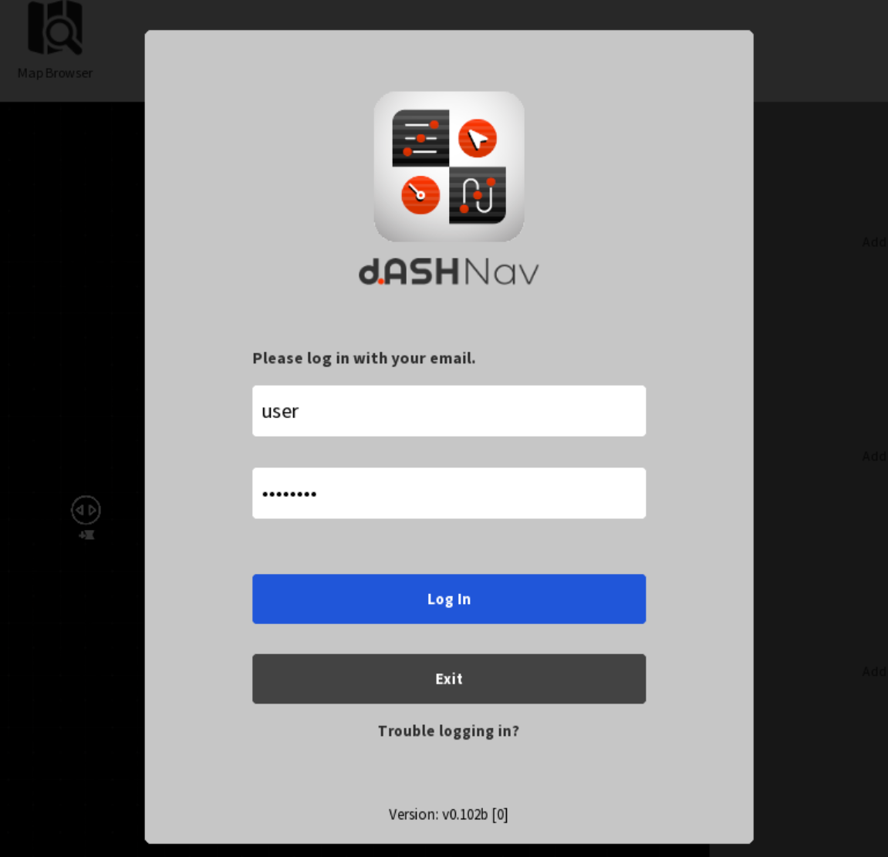
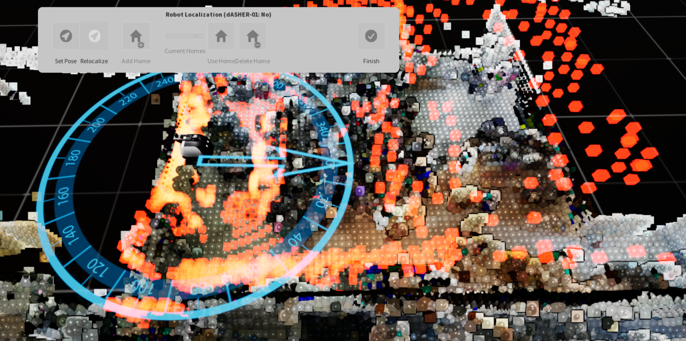

<style>
    a:hover {
        text-decoration: underline;
    }

    .instructions-div {
        display: flex; 
        align-items: center; 
        margin-right: 10px;
    }

    .instruction-circle {
        width: 18px;
        height: 18px;
        background-color: #ff3300;
        border-radius: 50%;
        display: flex;
        justify-content: center;
        align-items: center;
        color: white;
        font-size: 12px;
        font-weight: bold;
        border: 1px solid #ff3300;
    }

    .table_contents {
        color: black;
        text-decoration: none; 
    }

    .table_contents:hover {
        text-decoration: underline;
    }

    .instructions-div p {
        font-size: 18px;
    }
</style>

# **1. d.ASH Ops**
*d.ASH Ops* is *the* platform for autonomous control of robots. Being seamlessly integrated in the [d.ASH Fleet Management](https://www.dconstruct.co/products) workflow, you can enjoy easy planning and deployment of your robots for various use cases. *d.ASH Ops* allows you to plot waypoints for autonomous navigation on maps, tracking and monitoring path planning, as well as overall monitoring of your robots.

Because *d.ASH Ops* is fully integrated with [d.ASH Fleet Management system](https://www.dconstruct.co/products), an internet connection is required. Should you require *d.ASH Ops* without an internet connection, please [contact us](mailto:hello@dconstruct.group) for more details.

### **1.1 Minimum System Requirements**

1. PC with a CPU equivalent to or greater than an Intel(R) Core(TM) i5-10210U
2. Nvidia GTX 1060
3. 8GB of RAM
4. Internet Connection
5. Windows 10/11
6. Gamepad/Joystick (e.g. Logitech F710 Gamepad)

*We recommend using a discrete Nvidia GPU greater than or equivalent to an RTX 3060. Some features may run slower on other GPUs. A joystick is recommended for manual tele-operation control. We also recommend 16GB of RAM for smoother operation*

### **1.2 Tutorial**

**Control Scheme**

*d.ASH Ops*'s control scheme is as follows:

- Tilt/Camera: Hold down the *Right Mouse* Button and drag
- Zoom: Use the mouse scroll wheel to zoom in/zoom out
- Move Around: Use the *WASD* keys to pan/move around the world

### **1.3 Quick Start**

The general workflow to operate and run an autonomous waypoint mission is as follows:

1. Login to *d.ASH Ops*
2. Create a new project, this allows you to save any routes created for use later on
3. Load the map of your choice
4. Create a new mission Route and plot the waypoints
5. Connect to your desired robot in your robot fleet
6. Set the robot's initial starting pose on the 3D map
7. Start the robot with the route for your new mission

| Instructions |
| ------- | 
| <div class="instructions-div" id="step1"><div class="instruction-circle">1</div><p style="margin: 0; margin-left: 5px;">Login to *d.ASH Ops* with your given credentials.</p></div> |
| <div class="instructions-div"><div class="instruction-circle">2</div><p style="margin: 0; margin-left: 5px;">Create a new project.</p></div> <font size='2'>This allows you to save any routes created for use later on.<br> |
| <div class="instructions-div"><div class="instruction-circle">3</div><p style="margin: 0; margin-left: 5px;">Load the map of your choice.</p></div><font size='2'>|
| <div class="instructions-div"><div class="instruction-circle">4</div><p style="margin: 0; margin-left: 5px;">Create a new mission route and plot the waypoints.</p></div><font size='2'>Refer to [Section 5](#5-plan-tab) for more details regarding creating a route.<br> |
| <div class="instructions-div"><div class="instruction-circle">5</div><p style="margin: 0; margin-left: 5px;">Connect to your desired robot in your robot fleet.</p></div><br> |
| <div class="instructions-div"><div class="instruction-circle">6</div><p style="margin: 0; margin-left: 5px;">Set the robot's initial starting pose on the 3D map.</p></div><font size='2'>Refer to [Section whatever](placeholder) for more details on how to localise your robot.<br> |
| <div class="instructions-div"><div class="instruction-circle">7</div><p style="margin: 0; margin-left: 5px;">Start the robot with the route for your new mission.</p></div>

## **2. Download**
Please [contact us](mailto:hello@dconstruct.ai) for the link to download *d.ASH Ops*.

## **3. Project Management**
Once you've logged in, you will be greeted by the project window. Here, you can manage all existing projects as well as create new projects. These projects are synced to the cloud, thus allowing you to manage your projects and use *d.ASH Ops* from anywhere in the world!


### **3.1 Creating a project**
To create a new project, simply click on the "New Project" button. You will then be prompted to enter a project name. After creating your new project, you will be redirected to the *Map Browser*.  If a project with the same name exists, a prompt will pop up asking you to choose another name for the project.

### **3.2 Loading an existing project**
To load an existing project, select an existing project saved to the cloud using the file browser on the right hand side of the screen. Alternatively, if you are loading a project saved locally, click on the "Browse" button and navigate to the local location of the project. After creating your new project, you will be redirected to the *Map Browser*.

### **3.3 Map Browser**
After creating/loading an existing a project, you will be taken to the *Map Selection Screen*. This screen allows you to select the map which relates to your deployment location. After selecting your map, you can begin to deploy your robots. Maps can be sorted by whether they are coloured or not.


## **4. Main Menu**
This is the main hub of all things *d.ASH Ops*. Everything concerning deployment of your robots can be found here.

## **4.1 Top Menu**
The top bar contains several crucial pieces of information, such as which part of the deployment process you are currently in and actions that you can perform in each part of deployment. In the *Main Menu*, options to manage your projects and browse through available maps are available. The arrows indicate the proper flow of how a deployment should be run.

### **4.1.1 Project Options**
-  *New Project*: Create a brand new project
-  *Open Project*: Load an existing project
-  *Save*: Save any changes to the current project
-  *Save as*: Save any changes to the current project under a different file/project name
-  *Preferences*: Edit *d.ASH Ops* settings

### **4.1.2 Map Browser**
-  *Map Browser*: Browse through all maps saved to your account

## **4.2 View Port**
This is a visual representation of the map you have loaded for your project. 

- *View Toggles*: A widget in the top left corner of the *View Port* which allows you to toggle the visiblity of certain objects in the *View Port*.
- *Height Sliders*: Adjust the cut off points for rendering of the loaded map.
<!-- - *Orientation Gizmo*: A gizmo in the top right corner of the *View Port* shows the current orientation of the map, relative to the orientation of the floor. -->

## **4.3 Side Bar**
The *Side Bar* contains all information to do with any planned routes, connected robots and *View Port* visualisation tweaks

- *Routes*: Contains all planned routes in the project with the ability to toggle the preview of the route in the *View Port*, view all robots assigned to this route, assign new robots to this route and delete existing routes. This also reflects the current mission's route and status.
- *Robot List*: Shows you all currently connected robots and their status.
- *Visualisation*: Allows for you to tweak the colour of elements in the rendered point cloud as well as the scale (size) of the rendered robot and waypoints. This is more useful for those who experience colour blindness. We recommend leaving these settings at their default value.

## **5. Plan Tab**
This tab contains all actions to do with planning routes.

### **5.1 Actions**
Three actions are available for you to use:

-  *Autodrive*: Using machine learning and computer vision to analyze and understand your robot's surroundings, hands-free Level 2 Autonomy allows for the navigation of complex, unstructured environments using just cameras alone.
-  *Record Waypoints*: Records and plots waypoints as you manually navigate the robot in real life.
-  *Create Route*: Creates an empty route for you to edit and add waypoints later on.

### **5.2 Edit Waypoint**
This menu contains all available actions for editing waypoints on a route. This is greyed out by default and will only be accessible after selecting a route to edit. Several options are available to you.


-  /  *Add/Delete Waypoint*: Add or remove a waypoint from a selected route
-  *Reposition Waypoint*: Select a waypoint to shift the waypoint from one position to another. 
- *Interpolation by distance*: Adds additional waypoints between two existing waypoints which are too far apart. This allows for more actions (such as scans) to be excuted along a given path. The default interval is set at 1m.
-  /  *Enable/Disable Scan*: Marking a waypoint as a scan point will tell the robot to stop and perform a scan with 3rd party scanners.
-  *Scan All*: Marks all waypoint as a scan point. This will tell the robot to stop and perform a scan with 3rd party scanners.
-  *Finish*: Closes the menu.

### **5.3 Recording Waypoint**
You can use a robot in your fleet to record a mission route. This requires manual teleoperation of the robot for the first recording, but you do not need to have manual control afterwards.

| Instructions |
| ------- | 
| <div class="instructions-div" id="step1"><div class="instruction-circle">1</div><p style="margin: 0; margin-left: 5px";>Click 'Record Route'.</p></div> |
| <div class="instructions-div"><div class="instruction-circle">2</div><p style="margin: 0; margin-left: 5px;">Select the robot which you want to record the route with.<font size='2'>This allows you to save any routes created for use later on.<br> |
| <div class="instructions-div"><div class="instruction-circle">3</div><p style="margin: 0; margin-left: 5px;">Set an appropriate interval between recorded waypoints.</p></div><font size='2'>We recommend setting a lower interval in tight areas and a higher interval in open areas.|
| <div class="instructions-div"><div class="instruction-circle">4</div><p style="margin: 0; margin-left: 5px;">Start recording the route.</p></div> |
| <div class="instructions-div"><div class="instruction-circle">5</div><p style="margin: 0; margin-left: 5px;">When you are finished recording, stop the recording of the route.</p></div><br> |

### **5.4 Robot List**
Clicking this button will show a popup containing a list of all available robots. Connect to your preferred robot from this popup menu.

## **6. Ready Tab**
The **Ready Tab** contains all the actions needed for you to ready your robot for deployment.

### **6.1 E-Stop/Resume**
The emergency stop and resume buttons allow you to force-stop all robots in your fleet in the event of an emergency.

### **6.2 List of robots**
Shows a list of all connected robots with several different pieces of information tied to each robot.
- *Health Monitor*: The health monitor shows the status of all sensors on the robot.
- *Robot Info*: Contains info such as the robot's serial number, date of purchase etc
- *Robot Settings*: Adjust the tag settings of a selected robot through colour tags.

### **6.3 Robot Actions**
-  *Localise*: Give the robot an estimate of where it currently is on the map in order for the robot to fine tune its position.
-  *Follow Cam*: Sets the camera of the *View Port* to follow and track the robot as it moves throughout the map.
-  /  *Auto/Manual Control*: Manually change the operating mode of the selected robot.
- *Sit/Stand Robot*: **SPOT ONLY**. Sit or stand Boston Dynamics Spot Robot.

### **6.4 Assign Route to Robot**
- *Drop Down*: Choose the route to assign.
- *Tag Robot*: Choose the robot to assign the route to (i.e: tagging the robot)

## **7. Monitor Tab**
This tab contains all actions and information about the mission in progress.

### **7.1 E-Stop/Resume**
Controls for stopping and resuming a mission/robot movement can be found here.
-  *Stop All*: Stops all robots in case of an emergency.
-  *Resume All*: Resumes all robots that are stopped.

### **7.2 Live views**
Views from the cameras on the robots can be found here. To add a view, simply drag and drop a robot from the right side bar into an empty view slot and select which camera to view. There are three templates to follow.

-  *Map View*: Shows less of the view from the robot cameras to make space for viewing the Point Cloud Map.
-  *Four View*: This view will completely hide the Point Cloud Map and instead show four slots for different robot camera views.
-  *Focus*: This view will completely hide the Point Cloud Map and instead show only one robot camera view.
-  *Hide*: Disables all cameras/shows only the Point Cloud Map

### **7.3 Robot Controls**
-  *Run Route*: Issues the command to the selected robot to run its assigned route
-  *Autodrive*: [See above](#51-actions)
-  /  *Auto/Manual 
- *Sit/Stand*: [See above](#63-robot-actions)

## **8. Telegram Configuration**
d.ASH Ops supports status notifications of the robots in your fleet via Telegram! Add [dconstruct-bot](https://t.me/dconstruct_bot)!

### **8.1 Setup**
1. Add the Telegram bot to the Telegram chat of your choice
2. Request for a key from us [here](mailto:hello@dconstruct.ai).
3. In the Telegram chat of your choice, use the ```/register``` command followed by the key. (e.g. ```/register [insert key here]```)

### **8.2 Remove from chat**
If you would like to stop receiving notifications, use the ```/delete``` command.