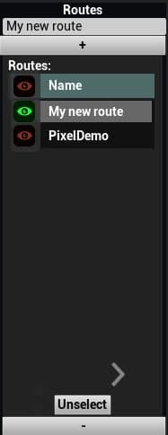
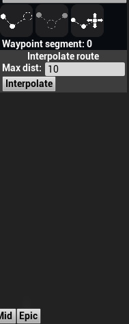

# d.ASH Autonomy Controller

As mentioned previously, the d.ASH autonomy controller is a GUI (graphical user interface) for the d.ASH SDK. It allows users to plot waypoints for autonomous navigation on maps, tracking and monitoring path planning. This section of the d.ASH SDK documentation provides details about setting up the d.ASH autonomy controller, including information on its respective components.

| d.ASH Autonomy Controller | Description |
| ------- | ------- |
| { align=left style="width:3000px"} |  Pair d.C Pilot with [d.ASH Autonomy Controller](/dash-sdk/dash-auto/autonomy-client) for remote autonomous operations. This app allows you to control multiple robots and author + run autonomous waypoint missions configured with different payloads.

## Camera Controls
You can pan/zoom/fly around the 3D Map Visualization World via the following controls:

- **Tilt/Camera LookAt:** Hold down the **Left Mouse** Button and drag
- **Zoom:** Use the mouse scroll wheel to zoom in/zoom out
- **Move Around:** Use the **WASD** keys to pan/move around the world

## General Workflow

The general workflow to operate and run an autonomous waypoint mission is as follows:

1. Login to the Autonomy Controller
2. Load the point cloud map of your deployment location generated with **d.ASH Pack** into the app
3. Create a new mission Route and plot the waypoints
4. Connect to your desired robot in your robot fleet
5. Set the robot's initial starting pose on the 3D map
6. Start the robot with the route for your new mission

---
### 1.0 ^^Load Point Cloud Map^^
{ .center style="width:300px"} 

Click on the **Point Cloud** icon to open up the point cloud loading window. Then click on **Load Point Cloud**. A file dialog will pop up to allow you to load your desired point cloud from disk. ***Make sure the same point cloud map is also configured on the robot(s).***

---
### 1.1 ^^Robot Fleet Manager^^
{ .center style="width:800px"}

The lower expandable panel opens up the **Robot Fleet Manager**. This displays the list of robots currently registered and also alive under your user account. You connect your desired robot by locating your robot in the icon list and then clicking on the **connect** icon. When the robot is connected, the following display appears:
{ .center style="width:800px"}

You are now able to inspect various properties of the robot ( battery status, LIDAR color etc. ) as well as start launching autonomous waypoint missions for this connected robot.

---
### 1.2 ^^General Settings^^
{ .center style="width:200px"}

The **General Settings** expandable panel from the left side of the screen. In here you can configure various options to streamline robot operations.

- **General:** This allows the customization of route/waypoint + map display settings
- **Robot Viz:** Visualization settings pertaining to the robots operated in the app
- **Map Viz:** Visualization settings for the 3D map display. In particular, use the **Floor** and **Ceiling** sliders to adjust how much of the 3D map height-wise 

---
### 1.3 ^^Routes + Waypoints^^
{ .center style="width:150px"}

This subpanel can be accessed by expanding the panel on the right side of the screen. It allows you to manage the various mission routes available for your robots. To create a new route, you do the following:

1. Enter a new **Route Name** in the textbox provided
2. Click the **+** button to add a new route
3. Select the newly route by clicking on it
4. Now go into the main 3D Map display to start plotting your waypoints for the route.

You can **Append/Splice/Modify** a route via the subpanel below:
{ .center style="width:120px"}

With the desired waypoint plotting option selected, you can go ahead and plot the waypoint directly with the mouse:

{ .center style="width:300px"}

Tap the **ESC** key to exit the waypoint plotting operation. If you need to delete a waypoint, you can select it via a mouse click on the 3D Map, then press the **Delete** key.

### 1.4 ^^Settings the Initial Robot Pose^^

When you activate a new robot into the app, the first required step is to tell the system where the robot is and where it is facing in relation to the 3D map. This step is defined as setting the **Initial Pose** of the robot. You set the **Initial Pose** via the following steps:

1. Click on the **Initial Pose** arrow button on the lower expandable panel to start the **Initial Pose** operation:
{ .center style="width:300px"}

2. Go to the 3D map, hold down your mouse on the part of the map where the robot is. Drag a direction and release to set the pose of the robot
{ .center style="width:300px"}

3. If the pose was set incorrectly, you can repeat steps 1 and 2 until the ***LIDAR scans of the robot matches that of the 3D map.*** This is when you know the **Initial Pose** is setup correctly.

**Take Note:** It is ***very important*** the **Initial Pose** of the robot is setup correctly before starting any **Waypoint Autonomy Mission**! Incorrect initial poses will result in the robot unable to localize correctly leading to mission failure.

### 1.5 ^^Mission Routes/Management^^

{ .center style="width:800px"}

This expandable panel located at the top part of the screen allows you to start new waypoint missions as well as manage existing missions. To start a new mission:

1. Enter a new mission name in the textbox, then press the **+** button to add a new mission
2. Select the new mission and press the **Run** button to start it
3. You should now see your robot move in the 3D map viewer along the mission route

### 1.6 ^^Robot Camera Streaming^^

{ .center style="width:300px"}

You can activate any available cameras on the robot via the **Camera Stream** button circled red above. When pressed, a new **Camera Stream** window pops up:

{ .center style="width:300px"}

Select the robot which you will want to stream the camera from via the top drop down box. Then use the lower drop down box to select which of the available robot cameras to stream from.

### 1.7 ^^Robot Remote Piloting/TeleOps^^

The app also allows basic remote manual piloting of your robots. Just like the **Pilot Client**, plug in a regular joystick into your system to begin manually piloting your robots. You will have to activate the robot for manual control via the manual control button located in the lower expandable panel before piloting is enabled.

