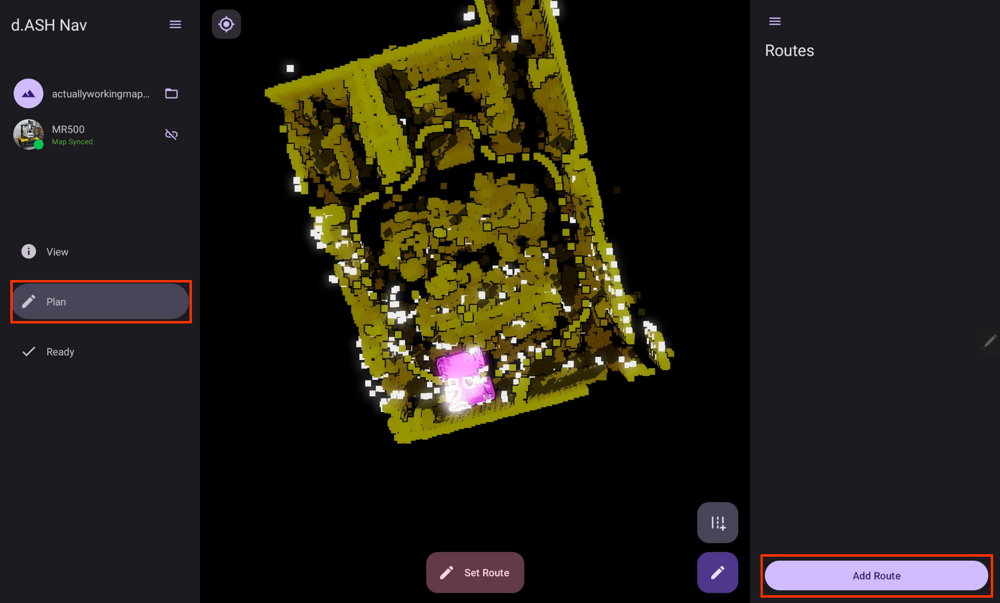
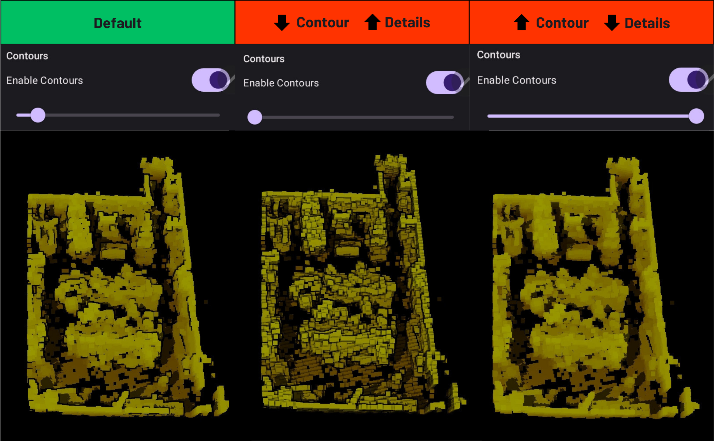
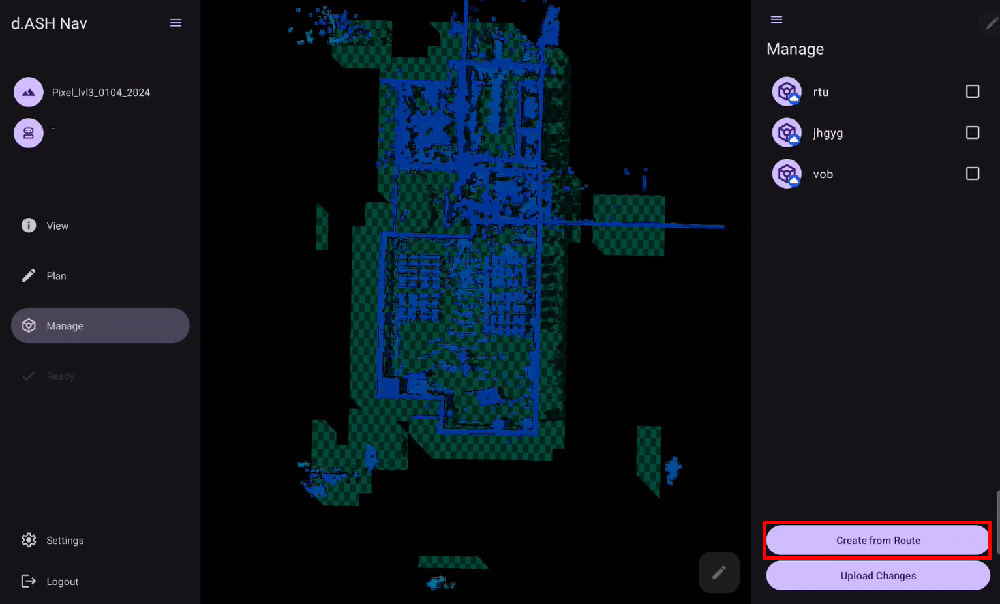
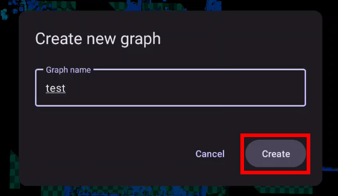
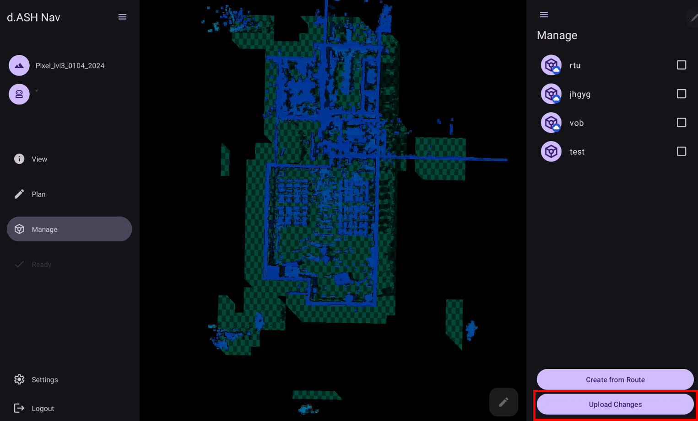

# **d.ASH Ops Mobile**

## **Introduction**

Welcome to the *d.ASH Ops Mobile* application user guide! Whether you're using a mobile device or computer desktop for robot operations, we've got you covered. Now, let's delve into the functionalities that *d.ASH Ops Mobile* offers for seamless robot operations and the respective steps for each of them!

---

## 1. **Application Functionalities**

*d.ASH Ops* is the platform for autonomous control of your robots. Being seamlessly integrated in the *d.ASH Fleet Management* workflow, you can enjoy easy planning and deployment of your robots for various use cases. *d.ASH Ops* allows you to plot waypoints for autonomous navigation on maps, tracking and monitoring path planning, as well as overall monitoring of your robots.

An internet connection from your robot is required. Should you require *d.ASH Ops* without an internet connection, please contact us [here](mailto:hello@dconstruct.group) for more details.

 **Pilot**

Control your robots manually with low latency and high performance at any time, from any location, and in any setting.

 **Live Video Streaming**

Use *d.ASH Ops* to stream live video camera feeds from your robots, facilitating operation in environments with weak network infrastructure. Stay connected with minimal latency and take control of your robot across the country with *d.ASH Ops*.

 **Waypoint Autonomy**

Empower your robots with *d.ASH Ops*'s advanced route creation and optimization capabilities. Seamlessly set precise routes and execute BLK scans tailored to your unique use cases. Elevate your automation experience with our state-of-the-art Waypoint Autonomy feature.

 **Enhanced Safety and Risk Mitigation**

*d.ASH Ops* enables robots to make informed choices to avoid obstacles and optimize their routes, mitigating potential risks while running routes and enhancing overall safety. This not only protects the robots themselves but also minimizes the risk of accidents or collisions with humans and other objects in the environment.

Now, let's explore how to make the most out of *d.ASH Ops* on your devices.

---

## 2. **d.ASH Ops for Android**
This comprehensive guide will walk you through setting up the application and give you detailed insights into every function of the **d.ASH Ops* Android application. Additionally, you'll find step-by-step instructions on how to control your robots directly from your devices and create routes for waypoint automation.

### 2.1 **Installation Guide**
Before installing, ensure that your mobile device meets the minimum system requirements. 

| Minimum System Requirements                                       | Recommended System Requirements                                   |
|-------------------------------------------------------------------|-------------------------------------------------------------------|
| Android Tablet with support for OpenGL ES 3.2                     | Android Tablet with support for OpenGL ES 3.2                     |
| Operating System: Android Version 13 \| Tiramisu \| API Level 33  | Operating System: Android Version 13 \| Tiramisu \| API Level 33  |
| CPU: Qualcomm Snapdragon 720G                                     | CPU: Qualcomm Snapdragon 888                                      |
| GPU: Adreno 618                                                   | GPU: Adreno 730                                                   |
| RAM: 4 GB                                                         | RAM: 8 GB                                                         |
    
### 2.2 **Your Account**
Login to *d.ASH Ops* with your given credentials.
If you encounter any difficulties with logging in, please contact us [here](mailto:hello@dconstruct.group).

 

### 2.3 **Quick Start Guide**  
The following section provides a step-by-step guide to help you record and set your desired route for the robot to follow, as well as perform BLK scans. Additional features offered by *d.ASH Ops* are listed in the subsequent sections.

| Instructions |
| ------- | 
| 

1

Connect to your robot and load your map into the application. 

 Refer to [Section 3.1](#31-connecting-to-your-robot) and [Section 3.2](#32-loading-in-your-map-file) for a guide for your robot and map respectively.|
| 

2

Localise your robot onto the map. 

 Refer to [Section 5.3](#53-localising-your-robot) for a guide to giving your robot a good initial pose estimate.|
| 

3

Inside the 'Plan' tab, select 'Add Route' and give your new route a name.

  Choose a name that is both memorable and descriptive.|
| 

4

Select the route you just created and press the 'Record Route' button at the bottom right to record your route by manually moving your robot.

!  Alternatively, you can refer to [Section 6.1.2](#612-create-routes-by-plotting-waypoints-on-the-map) to learn how to record your route by manually plotting waypoints onto the map.|
| 

5

Use the joysticks to drive your robot along your preferred route. 

 Be sure to change the recording intervals and make use of the 'Add Point' buttons while recording your route. For example, when turning the robot, you can lower down the recording interval to about 1 metre for a better route recording, or use the 'Add Point' button to plot waypoints close to each other in this turn. |
| 

6

Once you are satisfied with your route, select 'Save Recorded Route'.

 Or, if you would like to restart, select discard route at the bottom.|
| 

7

Optional: Choose the points in your route where you would like your robot to apply a BLK scan. 

 Refer to [Section 6.1.3.2](#6132-auto-generation-of-scan-points) for a full guide on choosing waypoints to perform BLK scans.|
| 

8

In the list of routes, press the route you just created and select 'Set Route' located at the bottom of the screen. 

 |
| 

9

Head back to the 'Ready' tab and change the control mode at the bottom to 'Auto'. 

  Well done! Your robot is now running on your recorded route that you have made.|

If you do not have access to internet at the location where you want to run your robot processes, you can use [Offline Mode](#8-offline-mode).

---

## 3. **Welcome to d.ASH Ops Mobile!**

After signing into your account, you'll be directed to the main page where you need to load your robot and map files in order to get started.

### 3.1 **Connecting to your robot**

| Instructions |
| ------- | 
| 

1

Turn on your robot.

 Typically, robots are activated automatically by attaching a battery and pressing the Power ON button/switch. However, for robots that require activation through software, like the Boston Dynamics Spot, please refer to the detailed instructions provided on the robot manufacturer's website for specific guidance.|
| 

2

Ensure that your device is connected to the internet.

|
| 

3

Return to the application. On the left hand side, click on this button boxed in red to select your robot.

|
| 

4

Choose the robot that you intend to use.

 If your robot is not found, try to hard restart your robot or contact us for support.|

### 3.2 **Loading in your map file**

| Instructions |
| ------- | 
| 

1

Ensure that you have your map file.

 If you do not have one, please refer to our [*d.ASH Pack*](https://dconstruct-tech.github.io/dash-sdk/dash-pack/dash-pack/) guide to create your map.|
| 

2

On the left hand side, click on this button boxed in red to select your map.

 |
| 

3

Select the map that you intend to use.

 |

Your robot and map has now been loaded into *d.ASH Ops*. Select the 'Menu' icon on the top right hand corner to open up the options menu, where all functions and configurations are found.

The following sections will go over the functions in the [View](#4-view-tab) tab, which is responsible for changing the view of your map, as well as the [Plan](#6-plan-tab), [Manage](#7-manage-tab) and [Ready](#5-ready-tab) tabs which are responsible for all robot operations. 

---

## 4. **View Tab**
The view tab contains options for changing the view and configuring the map that was loaded into the application.

### 4.1 **Adjusting your view of the map**
 **Pinch** to zoom in or zoom out

 **Swipe with one finger** to adjust view angle

 **Swipe with two fingers** to move around the map

Select this button on the top left corner to reset view to default.

### 4.2 **Map View Configurations**
#### **Clipping** 
Move the points on the range slider to adjust how much floor/ceiling is shown on the map of your application.

#### **Contours**
Toggle on and off or adjust the contour level to adjust contour sensitivity. 

### 4.3 **Example of a bad map visualization**
The View Tab allows you to customise your map-viewing experience within the application. It provides you with the flexibility to configure the settings according to your preferences. While keeping the default settings is perfectly acceptable, it's recommended to adjust the thumbs in a way that ensures the floor of the map is visible, the ceiling is hidden, and artefacts remain visible for optimal viewing.

The ceiling covers the entire map and you are unable to see the artifacts below, hence this is a bad map visualization. To make this visualization better and clearer, let's adjust the ceiling knob lower until the ceiling is hidden.

This way, we can better see where our robot is located on the map when we run a route or control the robot.

---

## 5. **Ready Tab**
Within this tab, you will find all the functions for managing the robot's live video camera streaming, taking manual control of your robot, and localisation, which is essential for the 'Plan' tab. 

### 5.1 **Live video streaming** 
To see your robot's camera view, select or toggle the camera options here. This can be found in the options menu on the right.  

You can also enlarge the camera view by pressing the enlarge button on the top left corner and adjusting the size to your preference. 

### 5.2 **Manually controlling your robot** 

| Instructions |
| ------- | 
| 

1

To move your robot, switch the control mode at the bottom of the application to 'Manual' mode.

Ensure that you are on the 'Ready' tab.|
| 

2

 Use the joysticks at the bottom to move your robot. 

The joystick on the left is used to move the robot front and backwards, while the joystick on the right is used to turn the robot left and right.|

### 5.3 **Localising your robot** 

Before delving into the features in the *Plan Tab*, it is essential to establish an initial pose estimate to localise your robot. Localisation is a crucial step for the robot to accurately determine its position within the provided point cloud map. This process is a prerequisite for enabling autonomy on the robot.

| Instructions |
| ------- | 
| 

1

Inside the options panel of the 'Ready' tab, press the 'Localise' button.

 Here, you can also find your robot status and see information like the battery level, localisation and stance.|
| 

2

Localise the robot by matching the point cloud of the current lidar scan to the map.

 Use the following buttons to help you achieve a good localisation.  Set Initial Pose: Press on the point of the map where the robot is located and drag it to the direction it is facing.  Rotate Pose: Used to adjust the rotation of the robot's LiDAR scan. Move Pose: Used to move the robot's LiDAR scan around the map.  Reset Pose: Resets your current localisation.   Done Button: Saves your current localisation.   To localize your robot, start by selecting the 'Set Initial Pose' button. Press on the point of the map where the robot is located and drag it to the direction it is facing. After which, you will be directed to the 'Move Pose' mode where you can use the directional arrows adjust the robot's LiDAR point cloud to fit the map as shown in the example below.   Additionally, you can use 'Rotate Pose' to rotate the LiDAR point cloud to make fitting it to the map easier.   Refer to the examples below for instances of successful robot localisation. You may also refer to the 'Robot Status' section where the localisation result is shown. The localisation of the robot is good when the robot's current LiDAR scan (white points) is aligned well to the map, meaning it has a good initial pose estimate. The localisation on the other two examples are bad as the LiDAR scan does not line up with the map, and the robot is in the wrong position.|
| 

3

Bring down the plane of the map.

 Using the slider on the left, adjust the map plane such that the floor of the map is now visible.|
| 

4

Once you are done with setting your robot's initial pose estimate, select the 'Done' button.

 On the other hand, if you would like to restart the localisation process, press on the 'Reset Pose' button.|

Upon submitting the initial pose estimate, the robot will attempt to determine its current position on the map. During this process, there may be a momentary "jump" in the robot's position. You are advised to manually move the robot around using the robot's controller to ensure that the LiDAR point cloud is still aligned with the map. 

Redo the localisation process if the LiDAR point cloud no longer aligns with your map. 

---

## 6. **Plan Tab**
The plan tab is used for preparing routes for your robots to follow and perform BLK scans.

### 6.1 **Creating your route**
Before starting, ensure that you have our localised your robot to the map. Refer to [Section 5.3](#53-localising-your-robot) if you require a guide to localise your robot onto the map. 

At the bottom right corner of your screen, select on the 'Add Route' button.

Give your new route a name. It is advised to use a name that is descriptive and well labelled.

#### 6.1.1 **Create routes by manually controlling of your robot**
From the list of routes on the right side, select the route that you have just created and press the 'Record Route' button boxed in red to record your route. 

You will then be directed to the route recording view. Here, you will be able to use the joysticks and 'Add Point' buttons at the bottom to manually control your robot, creating your route. 
You are advised to use a smaller recording interval (1 metre or smaller) when making turns. 

After moving your robot, you should see a blue-coloured path being formed by the robot. This is the path your robots will follow when you run the route you are creating.

Once you are finished with setting your route, press 'Save Recorded Route' at the bottom of the screen and you will be directed back to the routes page with your new route saved. Now, you will be able to make your robot run the route you have created. Refer to [Section 6.4](#64-running-your-routes).

#### 6.1.2 **Create routes by plotting waypoints on the map**
From the list of routes on the right side, select the route that you have just created and press this button boxed in red to record your route. 

You will then be directed to the waypoint editing page.

Here, you will be able to use the buttons below to add, delete and move waypoints around the map to create the final route for your robot to follow. 

Add Mode: Add waypoints by manually plotting them onto your map

Remove Mode: Remove waypoints by selecting the waypoint you want to remove on the map

Move Mode: Move waypoints from one point of the map to another

Done Button: Finalise and save your plotted route. 

Scan Mode: Covered in [Section 6.1.3.3](#6133-manually-setting-scan-points).

To plot your route, select the 'Add Mode' button at the bottom of the screen. Then, plot the various points on the map where you want your robot to travel along. Ensure that the points are next to each other, avoiding any obstacles in the map and hence in real life.

If you want to delete a waypoint, select the 'Remove Mode' button, and click on the waypoints that you would like to delete.

If you would like to move one of your waypoints, select the 'Move Mode' button and press on the waypoint that you would like to move. Drag this waypoint to your desired location on the map. 

Once you are finished with plotting your route, select the 'Done' button on the left of the mode buttons. Now, you will be able to make your robot run the route you have created. Refer to [Section 6.4](#64-running-your-route).

#### 6.1.3 **BLK Scanning**
Before setting BLK scan points, you can configure your LiDAR configurations depending on your use case. 

#### 6.1.3.1 **BLK Configurations**
##### **LiDAR Scan Quality**

LiDAR Scan Quality affects the density of the data points generated in your point cloud map. 

 Low: This option would produce a sparse point cloud map, but it does so at a much quicker rate.

 Medium: This option strikes a balance between point cloud density and scanning efficiency.

 High: This option will generate a dense point cloud map, but it takes considerably more time to do so.

##### **Image Capture Mode**

 None: Does not utilize the camera for capturing images.

 LDR (Low Dynamic Range): Details in shadows may be lost or details in highlights may be blown out.

 HDR (High Dynamic Range): More detail in both highlights and shadows can be captured. 

#### 6.1.3.2 **Auto generation of scan points**
In this section, you can automatically generate BLK scanning points in your route based on the distance travelled by the robot.
To use this, you must already have a route with waypoints. If you do not have one, refer to [Section 6.1.1](#611-create-routes-by-manually-controlling-of-your-robot) for a guide on recording your waypoints by manually controlling your robot or refer to [Section 6.1.2](#612-create-routes-by-plotting-waypoints-on-the-map) for a guide on creating your route by manually plotting waypoints.

To enable this feature, turn this option on and set a distance interval. If your set distance interval is two metres, the robot will run a BLK scan roughly every two metres travelled along your route.
 
The generated blinking points on the map is where your robot will apply a BLK scan.

To clear all BLK scanning points, select 'Clear all Scan Points' in the options menu. 

#### 6.1.3.3 Manually setting scan points
To use this, you must already have a route with waypoints. If you do not have one, refer to [Section 6.1.1](#611-create-routes-by-manually-controlling-of-your-robot) for a guide on recording your waypoints by manually controlling your robot or refer to [Section 6.1.2](#612-create-routes-by-plotting-waypoints-on-the-map) for a guide on creating your route by manually plotting waypoints.
Select the Scan Mode button at the bottom of the screen, and press the waypoints where you want your robot to perform a BLK scan. 

### 6.2 Editing or deleting your routes
Navigate to the right-hand side, where you'll find a list of the routes you've created. To edit or delete any of these routes, press and hold on the desired route. This action will reveal options such as rename, copy, and delete at the bottom of the screen. 

### 6.3 Running your routes
| Instructions |
| ------- | 
| 

1

Select the route that you would like to run.

You can find your routes in the routes section of the 'Plan' tab.|
| 

2

Once selected, press the 'Set Route' button located at the bottom of the screen.

|
| 

3

Switch to the 'Ready' tab and change the control mode to 'Auto'.

|
| 

4

Your robot will now run and follow the route that you've created.

|

## 7. Manage Tab
The *Manage Tab* is used for creating graphs from your routes and uploading or removing them from the cloud.

### 7.1 **Creating a graph from your route**
| Instructions |
| ------- |
| 

1

Press the 'Create from Route' button.

 |
| 

2

Select the route which you want your graph to be based off of and press the 'Create Graph' button.

 |
| 

3

Name your graph and press 'Create'.

 |

### 7.2 **Uploading graphs to the cloud**
| Instructions |
| ------- |
| 

1

Press the 'Upload Changes' button.

 |
| 

2

Select the graph that you want to upload, and then press the arrow pointing to the right, located in the middle of the screen.

 |
| 

3

Press the 'Confirm' button to confirm the transfer of your graph.

 |
| 

4

Your graph will now be in the cloud.

To remove a graph from the cloud, repeat steps 1-4 but select a graph on the right and press the left arrow button instead.

 |

### 7.3 **More Options**
To see more options, hold down on a graph to select it. More options will appear such as duplicate, rename and delete.

### 7.4 **Setting your graph as a route**
To set your graph as your robot's route, head to the [Plan Tab](#6-plan-tab) and switch to the *Graphs* section on the right. From here, you can see your created graphs and if they are uploaded on the cloud, you can set it as your robot's route by pressing the 'Set Auto Route' button on the bottom of the screen.

## 8. **Offline Mode**
If your scanning location does not have internet access, you can connect to your robot's hotspot through your device's Wi-Fi settings and use offline mode to login to your robot to carry out the same tasks as you would in online mode. To use this, you may follow the instructions below. 

Before using offline mode, ensure that your map has already been downloaded in online mode. This is because there is no internet connection and the app is unable to fetch the maps from your cloud. Refer to [Section 3.2](#32-loading-in-your-map-file) for a guide on loading your map into the application. 
 
| Instructions |
| ------- | 
| 

1

Set a local password to enable local robot login

Logged into the application (online mode), head into the 'Ready' tab and select 'Set Local Password' on the right of the screen.  For security purposes, you are advised to use a strong password that you can remember to prevent unauthorised access to your robot. |
| 

2

Connect to your robot's Wi-Fi hotspot.

Navigate into your device's settings, connections -> Wi-Fi, and connect to your robot's hotspot network.  Your robot's Wi-Fi network name and password will be provided to you. If you have trouble connecting to your robot's network, please contact us for support.|
| 

3

Head back into the application and enter offline mode that can be found in the login page.

|
| 

4

Connect to your robot.

On the left hand side of the main page, select on this button boxed in red to connect to your robot.  Your robot should appear now in the form of its IP address.  Select your robot and enter the local password that you have previously set in Step 1 to finally login.|
| 

5

Load in your map.

On the left hand side of the main page, select on this button boxed in red to load in your map.  You should already have your maps downloaded before using offline mode. If your map does not appear, it means that you have not downloaded it yet. Head back into online mode and refer to [Section 3.2](#32-loading-in-your-map-file) to download your map for offline use.|

You are now using offline mode. Now, you will be able to access the application's functionalities in locations without internet access.

---

That is all for d.ASH Ops Mobile!
If you require any support, please feel free to contact us [here](mailto:hello@dconstruct.group) if you encounter any difficulties.

Last updated: 10/25/2024