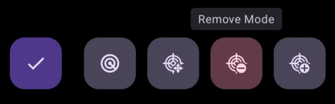

# d.ASH Nav

### Introduction

| { align=center style="width:400px"} |

Welcome to the d.ASH Nav application user guide! Whether you're using a mobile device or computer desktop for robot operations, we've got you covered. To access the user guide for your Android mobile devices, please refer to <a href="#section2">Section 2</a> in this page. For desktop usage, please turn to <a href="#">Section 3</a>.

Now, let's delve into the functionalities that d.ASH Nav offers for seamless robot operations and the respective steps for each of them!

### Table of Contents
This is the list of sections that can be found in our user guide. For quick access, simply click on the Section that you would like to see.

##### <a class="table_contents" href="#section1">1. Application Functionalities</a>

##### <a class="table_contents" href="#section2">2. d.ASH Nav for Android</a>
* <a class="table_contents" href="#section2_1">2.1 Installation guide</a>
* <a class="table_contents" href="#section2_2">2.2 Your account</a>
* <a class="table_contents" href="#section2_3">2.3 A Quick Start Guide</a>

##### <a class="table_contents" href="#section3">3. Welcome to d.ASH Nav!
* <a class="table_contents" href="#section3_1">3.1 Setting up your robot</a>
* <a class="table_contents" href="#section3_2">3.2 Loading in your map file </a>

##### <a class="table_contents" href="#section4">4. View Tab</a>
* <a class="table_contents" href="#section4_1">4.1 Adjusting map view</a>

* <a class="table_contents" href="#section4_2">4.2 Map View Configurations</a>
   
* <a class="table_contents" href="#section4_3">4.3 Good and bad map visualizations</a>

##### <a class="table_contents" href="#section5">5. Ready Tab</a>
* <a class="table_contents" href="#section5_1">5.1 Live camera streaming</a>
* <a class="table_contents" href="#section5_2">5.2 Manually controlling your robot</a>
* <a class="table_contents" href="#section5_3">5.3 Localizing your robot</a>

##### <a class="table_contents" href="#section6">6. Plan Tab </a>
* <a class="table_contents" href="#section6_1">6.1 Creating your route</a>
    * <a class="table_contents" href="#section6_1_1">6.1.1 Setting route via waypoint</a>
    * <a class="table_contents" href="#section6_1_2">6.1.2 Setting route via manual control</a>
    * <a class="table_contents" href="#section6_1_3 ">6.1.3 BLK scanning</a> 

        - <a class="table_contents" href="#section6_1_4_1">6.1.4.1 BLK Scan Configurations (LiDAR Scan Quality/Image Capture Mode)</a>
        * <a class="table_contents" href="#section6_1_4_2">6.1.4.2 Auto generation of BLK scan points</a>
        * <a class="table_contents" href="#section6_1_4_3">6.1.4.3 Manually selecting BLK scan points</a>
        
* <a class="table_contents" href="#section6_2">6.2 Editing and deleting your routes</a>
* <a class="table_contents" href="#section6_3">6.3 Running your routes</a>

##### <a class="table_contents" href="#section6">7. Offline Mode </a>
---

### 1. Application Functionalities

d.ASH Nav is the platform for autonomous control of your robots. Being seamlessly integrated in the d.ASH Fleet Management workflow, you can enjoy easy planning and deployment of your robots for various use cases. d.ASH Nav allows you to plot waypoints for autonomous navigation on maps, tracking and monitoring path planning, as well as overall monitoring of your robots.

An internet connection from your robot is required. Should you require d.ASH Nav without an internet connection, please contact us <a href="#">here</a> for more details.

    
    
Pilot

Our Pilot framework offers high-performance, low-latency, long-range remote operations. It allows you to take manual control of your robots at any time, from any distance, and in any environment.

    
    
Live Video Streaming

Our ultra-high-speed data streaming enables Pilot to stream live video feeds from robots, facilitating operation in environments with weak network infrastructure. Stay connected with minimal latency, you can take control across the country with d.ASH Nav.

    
    
Waypoint Autonomy

d.ASH Nav determines the real-time location of connected robots within millimetres. Just drop and add waypoints like markings on a map to automated patrol routes all thanks to d.ASH Nav’s seamless UI.

    
    
Enhanced Safety and Risk Mitigation

The software’s intelligent decision-making capabilities enable robots to make informed choices to avoid obstacles and optimize their routes, mitigating potential risks and enhancing overall safety. This not only protects the robots themselves but also minimizes the risk of accidents or collisions with humans and other objects in the environment.

Now, let's explore how to make the most out of d.ASH Nav on your devices.

---

 
### 2. d.ASH Nav for Android
This comprehensive guide will walk you through setting up the application and provide detailed insights into every function of the d.ASH Nav Mobile App. Additionally, you'll find step-by-step instructions on how to seamlessly control your robots directly from your mobile device.

 
### 2.1 Installation guide
Before installing, ensure that your mobile device meets the minimum system requirements. 

#### Minimum system requirements
Android Tablet with support for OpenGL ES 3.2
Operating System: Android Version 13 | Tiramisu  | API Level 33 
Screen Size: No smaller than 10.5 inches
Processor: Snapdragon 888 chip on the Samsung Galaxy Tab S8 

To find a list of compatible Android devices, click [here]().

 
### 2.2 Your account
Login to d.ASH Nav with your given credentials.
Your login details can be found in the email we have sent you. If you encounter any difficulties logging in, please contact us [here]().

### 2.3 Quick Start Guide  
The following section provides a step-by-step guide to help you record and set your desired route for the robot to follow, as well as apply BLK scans. Additional features offered by d.ASH Nav are listed in the subsequent sections.

| Instructions |
| ------- | 
| 

1

Connect to your robot and load your map into the application. 

 Refer to <a href="#section3_1">Section 3.1</a> and <a href="#section3_2">Section 3.2</a> for a guide for your robot and map respectively.|
| 

2

Navigate into the ready tab and select localise. 

 Refer to <a href="#section5_3">Section 5.3</a> for a guide to giving your robot a good initial pose estimate. |
| 

3

Inside the plan tab, select add new route and give your route a name.

  Choose a name that is both memorable and descriptive. |
| 

4

Press the record route button at the bottom right to record your route by moving the robot.

  Alternatively, you can refer to <a href="#section6_1_2">Section 6.1.2</a> to learn how to record your route by manually plotting waypoints onto the map. |
| 

5

Use the joysticks to drive your robot along your preferred route. 

 Be sure to change the recording intervals and make use of the add point buttons while recording your route. For example, at sharp turns, you can change the recording interval lower to about 1 metre. |
| 

6

Once you are satisfied with your route, select save recorded route.   

 Or, if you would like to restart, select discard route at the bottom.  |
| 

7

Optional: Choose the points in your route where you would like your robot to apply a BLK scan. 

 Refer to <a href="section6_1_4">Section 6.1.4</a> for a full guide on choosing waypoints to apply BLK scans.|
| 

8

In the list of routes, press the route you just created and select set route located at the bottom of the screen. 

 |
| 

9

Head back to the ready tab and change the control mode at the bottom to auto. 

  Well done! Your robot is now running on your recorded route that you have made.   |

---

### 3. Welcome to d.ASH Nav Mobile!

After signing into your account, you'll be directed to the main page where you need to load your robot and map files in order to get started.

### 3.1 Connecting to your robot

| Instructions |
| ------- | 
| 

1

Turn on your robot

 Typically, robots are activated automatically by attaching a battery and pressing the Power ON button/switch. However, for robots that require activation through software, like the Boston Dynamics Spot, please refer to the detailed instructions provided on the robot manufacturer's website for specific guidance. |
| 

2

Connect to the robot's WiFi network

 Open your mobile device's settings app, click on Connections -> Wi-Fi, and then connect to the network of your robot. After a successful connection, you should see 'Connected without internet' below the Wi-Fi network. If no network is found, it indicates that your robot may not have been turned on properly. |
| 

3

Return to the application. On the left hand side, click here to select your robot.

 |
| 

4

Choose the robot that you intend to use.

 If your robot is not found, try to hard restart your robot or contact us <a href="#">here</a> for support. |

### 3.2 Loading in your map file 

| Instructions |
| ------- | 
| 

1

Ensure that you have your map file.

 If you do not have one, please refer to our <a src="#">d.ASH Pack guide</a> to create your map. |
| 

2

On the left hand side, click on this button to select your map.

|
| 

3

Select the map that you intend to use.

|

Your robot and map file has now been imported. 

Select the menu icon on the top right hand corner to open up the options menu, where all functions and configurations are found.  

The following sections will go over the functions in the <a href="#section4">View</a> tab, which is responsible for changing the view of your map, as well as the <a href="#section6">Plan</a> and <a href="#section5">Ready</a> tabs which are responsible for all robot operations. 

---

### 4. View Tab
The view tab contains options for changing the view and configuring the map that was imported into the application.

#### 4.1 Adjusting your view of the map

    
    
Pinch to zoom in or zoom out

    
    
Swipe with one finger to adjust view angle

    
    
Swipe with two fingers to move around

Select this button on the top left corner to reset view to default. 

#### 4.2 Map View Configurations
##### Clipping 
Move the points on the range slider to adjust how much floor/ceiling is shown on the map of your application. 

##### Contours
Toggle on and off or adjust the contour level to change the amount of detail in data points. 
Toggle on and off or adjust the contour level to adjust contour sensitivity. 

#### 4.3 Example of a bad map visualization
The View Tab allows you to customise your map-viewing experience within the application. It provides you with the flexibility to configure the settings according to your preferences. While keeping the default settings is perfectly acceptable, it's recommended to adjust the thumbs in a way that ensures the floor of the map is visible, the ceiling is hidden, and artefacts remain visible for optimal viewing.

The ceiling covers the entire map and you are unable to see the artifacts below, hence this is a bad map visualization. To make this visualization better and clearer, let's adjust the ceiling knob lower until the ceiling is hidden.

This way, we can better see where our robot is located on the map when we run a route or control the robot.

---

### 5. Ready Tab
Within this tab, you will find all the functions for managing the robot's live video streaming, manual controlling, and localization, which is essential for the Plan tab. 

#### 5.1 Live video streaming 
To see your robot's camera view, select or toggle the camera options here. This can be found in the options menu on the right. 

<!--   -->

You can also enlarge the camera view by pressing the enlarge button on the top left corner and adjust the size to your preference. 

#### 5.2 Manually controlling your robot 

| Instructions |
| ------- | 
| 

1

To move your robot, switch the control mode at the bottom of the application to manual mode.

<fonst size="3"> Ensure that you are on the ready tab. |
| 

2

 Use the joysticks to move the robot. 

 The joystick on the left is used to move the robot front and backwards, while the right joystick is used to turn the robot left and right.|

#### 5.3 Localizing your robot 

Before delving into the features in the planning tab, it is essential to establish an initial pose estimate to initiate the robot's localisation. Localisation is a crucial step for the robot to accurately determine its position within the provided point cloud map. This process is a prerequisite for enabling autonomy on the robot.

| Instructions |
| ------- | 
| 

1

On the top of the right panel of the application, press the Localise button.

<fonst size="3"> Ensure that you are on the ready tab. Here, you can also find your robot status and see information like the battery, localisation and stance.|
| 

2

Localise the robot by matching the point cloud of the current lidar scan to the map.

 Press on the point of the map where the robot is located and drag it to the direction it is facing. Then, use the directional arrows to adjust the robot's LiDAR's point cloud to fit the map. Alternatively, you can use the rotation button to adjust and improve your pose estimate. |
| 

3

Bring down the plane of the map.

 Using the slider on the left, adjust the map plane such that the floor of the map is now visible. |

Upon submitting the initial pose estimate, the robot will attempt to determine its current position on the map. During this process, there may be a momentary "jump" in the robot's position. Users are advised to wait for a few seconds to ensure that the robot stabilises and remains at the correct position.

Refer to the examples below for instances of successful robot localisation.

The localisation of the robot is good when the robot's current LiDAR scan (white points) is aligned well to the map, meaning it has a good initial pose estimate. The localisation on the other two examples are bad as the LiDAR scan does not line up with the map, and the robot is in the wrong position. 

---

### 6. Plan Tab
The plan tab is used for preparing routes for your robots to follow and apply BLK scans.

#### 6.1 Creating your route
Before starting, ensure that you have our localised your robot to the map. Refer to <a href="#section5_3">Section 5.3</a> if you require a guide to localise your robot onto the map.  
At the bottom right corner of your screen, select on the 'App Route' button.

Give your new route a name. Try to use a name that is descriptive and well labelled.

You will then be directed to the route edit view. Here, you will be able to add and remove waypoints, change the configurations of BLK scanning, and generate scanning points around the map.

#### 6.1.1 Setting route by waypoints

To set your route, you can do it by manually making waypoints for the robot to follow. To do this, select the Add Mode button at the bottom of the screen. 

Plot the various points on the map that you want your robot to go. Ensure that the points are next to each other, avoiding any obstacles in the map and hence in real life.

If you want to delete a waypoint, select the Remove Mode button, and click on the waypoints that you would like to delete. 

Once you are finished with manually plotting your route, select the Done button on the left of the mode buttons. 

#### 6.1.2 Setting route via manual control of your robot
Add a new route and give it a name. Once you've created a new route, exit back to the routes page by pressing the done button. 
On the bottom right of your map screen, click on this button.
 
You will now have to manually control your robot around the map to create the path. Use the joysticks and 'Add Point' buttons to make your route. 

After moving your robot, you should see a blue-coloured path being formed by the robot. This path is the route you will set for your robots to follow.

Once you are finished with setting your route, press 'Save Recorded Route' at the bottom of the screen and you will be directed back to the routes page with your new route saved. 

Now, you will be able to make your robot run the route you have created. Refer to <a href="#section6_3">Section 6.3</a>.

#### 6.1.3 BLK Scanning
Before setting BLK scan points, you can configure your LiDAR configurations depending on your use case. 

#### 6.1.3.1 BLK Configurations
##### LiDAR Scan Quality
LiDar Scan Quality is the rate of how fast the LiDar spins, with low being the slowest and high being the fastest. Adjusting the LiDar Scan Quality would affect the amount of generated data points in your point cloud map. 

    
    
Low: Resulting point cloud map after scan will be least detailed but generation speed is much faster. Usually used in situations where the environment that you want to scan is simple and does not require much detail.

    
    
Medium: Resulting point cloud map after scan will have a satisfactory level of detail for most applications. This setting is suitable for environments that have a moderate level of complexity, where you want a reasonable level of detail without sacrificing scanning efficiency. 

    
    
High: Resulting point cloud map after scan will be very detailed but generation speed is much slower.

##### Image Capture Mode
 

    
    
None : Does not utilize the camera for capturing images.

    
    
LDR (Low Dynamic Range) : Details in shadows may be lost or details in highlights may be blown out.

    
    
HDR (High Dynamic Range) : More detail in both highlights and shadows can be captured. 

#### 6.1.3.2 Auto generation of scan points
In this section, you can automatically generate BLK scanning points in your route based on the distance travelled by the robot.

To enable this feature, turn this option on and set a distance interval. If your set distance interval is two metres, the robot will run a BLK scan every two metres travelled on your route.

The blinking points on your map is where your robot will apply a BLK scan. 

#### 6.1.3.3 Manually setting scan points
Select the Scan Mode button at the bottom of the screen, and press the waypoints where you want your robot to do a BLK scan. 

#### 6.2 Editing or deleting your routes
Navigate to the right-hand side, where you'll find a list of the routes you've created. To edit or delete any of these routes, press and hold on the desired route. This action will reveal options such as rename, copy, and delete at the bottom of the screen.

#### 6.3 Running your routes
| Instructions |
| ------- | 
| 

1

Select the route that you would like to run.

<fonst size="3">You can find your routes in the routes section of the plan tab.|
| 

2

Once select, press the Set Route button located at the bottom of the screen.

 |
| 

3

Switch to the ready tab.

<fonst size="3">|
| 

4

Switch the control mode to Auto.

<fonst size="3">|
| 

4

Your robot will now run and follow the route that you've created.

<fonst size="3">|

#### 7. Offline Mode

 
Enjoy using d.ASH Nav! If you require any support, please feel free to contact us <a href="#">here</a>. 