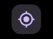
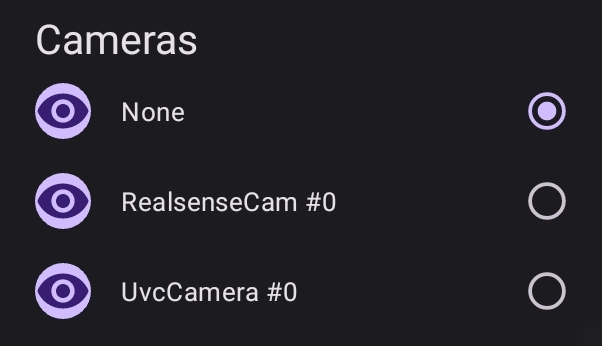
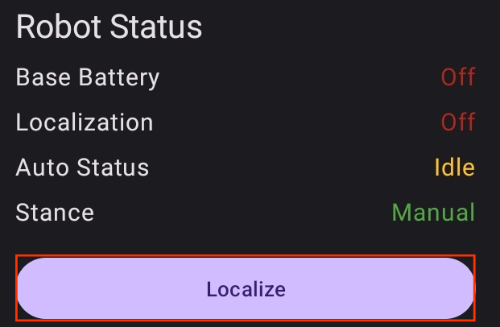
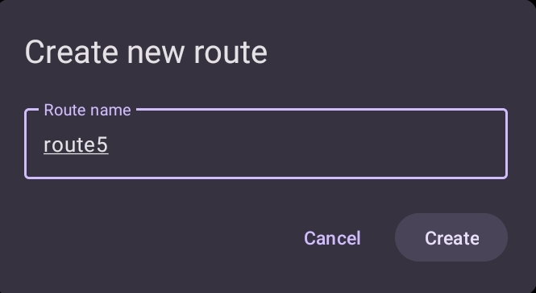
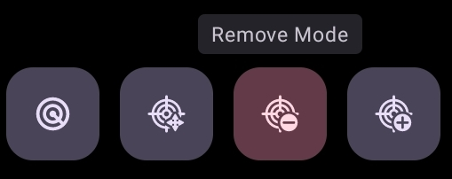
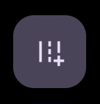
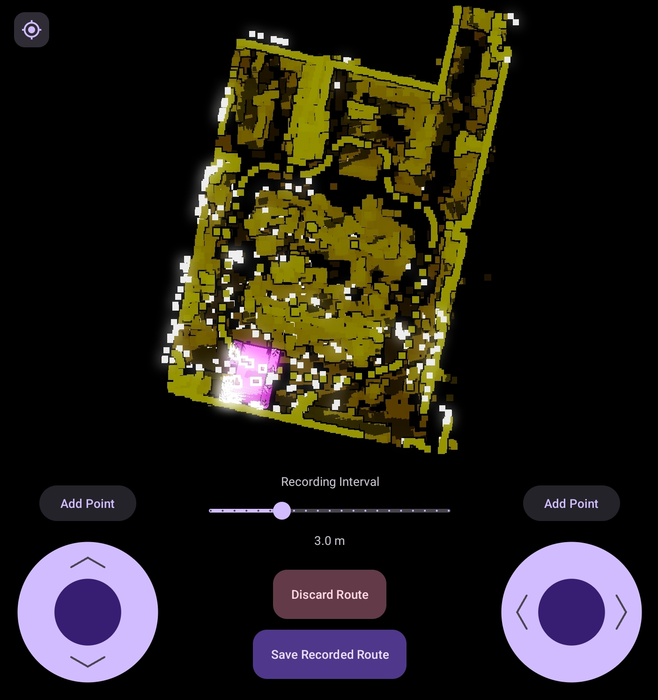

<link href="circlestyle.css" rel="stylesheet"></link>

# d.ASH Nav

### Introduction

| { align=center style="width:400px"} |

Welcome to the d.ASH Nav application user guide! Whether you're using a mobile device or computer desktop for robot operations, we've got you covered. For mobile device guide, refer to section 2 in this page. For desktop usage, please turn to section 3.

Now, let's delve into the functionalities that d.ASH Nav offers for seamless robot operations and the respective steps for each of them!

### Table of Contents

1. Application Functions
2. User Guide for *your Mobile Devices*
3. User Guide for *your Desktop Devices*

---

### 1. Application Functionalities

d.ASH Nav is the platform for autonomous control of robots. Being seamlessly integrated in the d.ASH Fleet Management workflow, you can enjoy easy planning and deployment of your robots for various use cases. d.ASH Nav allows you to plot waypoints for autonomous navigation on maps, tracking and monitoring path planning, as well as overall monitoring of your robots.

Because d.ASH Nav is fully integrated with d.ASH Fleet Management system, an internet connection is required. Should you require d.ASH Nav without an internet connection, please contact us for more details.

    
    
Pilot

Our Pilot framework offers high-performance, low-latency, long-range remote operations. It allows you to take manual control of your robots at any time, from any distance, and in any environment.

    
    
Live Video Streaming

Our ultra-high-speed data streaming enables Pilot to stream live video feeds from robots, facilitating operation in environments with weak network infrastructure. Stay connected with minimal latency, you can take control across the country with d.ASH Nav.

    
    
Waypoint Autonomy

d.ASH Nav determines the real-time location of connected robots within millimetres. Just drop and add waypoints like markings on a map to automated patrol routes all thanks to d.ASH Nav’s seamless UI.

    
    
Enhanced Safety and Risk Mitigation

The software’s intelligent decision-making capabilities enable robots to make informed choices to avoid obstacles and optimize their routes, mitigating potential risks and enhancing overall safety. This not only protects the robots themselves but also minimizes the risk of accidents or collisions with humans and other objects in the environment.

---

### 2. d.ASH Nav for Mobile
This user guide will cover every function in d.ASH Nav Mobile, as well as detailed explanations and necessary steps to take, for operating your robots through your mobile device. 

### 2.1 Setting up

### 2.2 Installation guide

#### Minimum system requirements
Android Tablet with support for OpenGL ES 3.2
Android Version 12 | Snow Cone  | API Level 31 

#### Recommended system requirements
Android Version 13 | Tiramisu  | API Level 33 

To find a list of compatible Android devices, click [here](https://www.mysmartprice.com/gear/android-12-update-tracker/).

### 2.3 Your account

Login to d.ASH Nav with your given credentials. If you encounter any difficulties logging in, please contact us [here]().

### 2.3.1 Offline mode

---

### 3. Welcome to d.ASH Nav!

After signing into your account, you'll be directed to the main page where you need to load your robot and map files.

| { align=center style="width:1000px"} | 

### 3.1 Setting up your robot 

| Instructions |
| ------- | 
| 

1

Turn ON your robot

 For most robots, they are automatically turned ON when you physically attach a battery and press the Power ON button/switch. For robots that need to be turned ON via software (such as the Boston Dynamics Spot), please follow the specific instructions found in the robot manufacturer's website. |
| 

2

Connect to the robot's WiFi network

 Open your mobile device's settings app, click on Connections -> Wi-Fi, and then connect to the network of your robot. After succesful connection, there should be 'Connected without internet' below the Wi-Fi network. If there is no network found, it means your robot has not been turned on properly. |
| 

3

Return to the application. On the left hand side, click on this button to select your robot.

 |
| 

4

Select the robot that you intend to use.

 If your robot is not found, please refer to our troubleshooting guide in <a href="#">Section 5</a> or contact us. |

### 3.2 Loading in your map file 

| Instructions |
| ------- | 
| 

1

Ensure that you have your map file.

 If you do not have one, please refer to our <a src="#">d.ASH Pack guide</a> to create your map. |
| 

2

On the left hand side, click on this button to select your map.

|
| 

3

Select the map that you intend to use.

|

Your robot and map has now been imported! 

Select the menu icon on the top right hand corner to open up the options menu.  

---

### 4. View, Plan and Ready Tabs 

### 4.1 View Tab
In this view tab, you will find options to change the view and configurations of the map imported into the application. 

#### 4.1.1 Adjusting the map view  
Pinch to zoom in and out  
Swipe to adjust view  
Swipe with two fingers to move around  

Select this button on the top left to reset view to default.  

#### 4.1.2 Clipping 
Move the points on the range slider to adjust how much floor/ceiling is shown on the map of your application.  

#### 4.1.3 Contours
Toggle on and off or adjust the contour level to change the amount of detail in data points.  

#### 4.1.4 Example of a good map visualization
The view tab is entirely used to change the way you see the map on the application and it is up to you on how you want to configure it. Leaving it as default is alright as well. But usually, you should adjust the thumbs such that the floor of the map is visible and the ceiling of the map is hidden but the artifects are still visible. 

### 4.2 Ready Tab
Inside this tab is where you find the functions to control your 

### 4.2.1 Live camera streaming 
To see your robot's camera view, select or toggle the camera options here. This can be found in the options menu on the right. 

 

### 4.2.2 Manually controlling your robot 
To move your robot, switch the control mode at the bottom of the application to manual mode.

Use the joysticks to move the robot. The joystick on the left is used to move the robot front and backwards, while the right joystick is used to turn the robot left and right. 

### 4.2.3 Localizing your robot 

Before we move on to the functionalities in the planning and ready tabs,  we will need to localize our robot. 

Localizing would ensure that our robot knows its exact location in real life and a good localization would ensure that we know where our robot is without actually looking at it in real life. 

| Instructions |
| ------- | 
| 

1

On the right side of the application, press the Localize button.

<fonst size="3"> Ensure that you are on the ready tab. Here, you can also find your robot status and see information like the battery, localization and stance.|
| 

2

Localize the robot based on its actual position in real life from the map.

 Press on the point of the map where the robot is located and drag it to the direction it is facing. Then, use the directional arrows to adjust it to fit the map. Alternatively, you can use the rotation button to adjust and improve your localizations. |

Some good robot localization examples are shown below.

Good localization is where the robots LIDAR visualization (white points) lines up with the map. 

`Make another example image as this image is not clear`

`Explain why its good localization and why its bad`

### 4.3 Plan Tab
The planning tab is for preparing routes for robot autonomy. 

### 4.3.1 Creating your route
Before starting, ensure that you have our localized your robot to the map. Refer to <a href="#">Section 4.2.3</a> for a guide on robot localization.  
At the bottom right corner of your screen, select on the 'App Route' button.

 
Give your new route a name, use a name that is descriptive. 

### 4.3.1.1 Initialize your BLK scanning configurations 

### 4.3.1.1.1 Lidar Scan Quality

    
    
Low : LIDAR spins at the slowest rate, which makes the resulting scan the least detailed.

    
    
Medium : LIDAR spins at a faster rate, which makes the resulting scan more detailed.

    
    
High : LIDAR spins at its fastest rate, which makes the resulting scan the most detailed.

### 4.3.1.1.2 Image Capture Mode

    
    
None : Does not utilize the camera for capturing images.

    
    
LDR (Low Dynamic Range) : Details in shadows may be lost or details in highlights may be blown out.

    
    
HDR (High Dynamic Range) : More detail in both highlights and shadows can be captured. 

### 4.3.1.1.3 Generating BLK scan points 
Here is where we select the points in our map to apply a BLK scan.

`Select points for scan image/gif` 

Points that are blinking??? indicate the points that robot will scan???

### 4.3.1.2 Setting route by waypoints
To set your route, you can do it by manually making waypoints for the robot to follow. To do this, select the Add Mode button at the bottom of the screen. 

 

If you want to delete a waypoint, select the Remove Mode button, and click on the waypoints that you would like to delete.  
 
Finally, select the Done button when you are finished with setting your route. 

### 4.3.1.3 Setting route by controlling your robot
Add a new route and give it a name. Once you've created a new route, exit by pressing the done button.  
On the bottom right of your map navigation screen, click on this button.  
  

### 4.3.2 Editing or deleting your routes
On the right hand side, there will be a list of your routes created. To edit or delete, tap and hold on the route and the edit and delete buttons will show up at the bottom. 

### 4.3.3 Running your routes and autonomous driving

### 4.4.1 Manually moving your robot

### 5. Case Scenarios

### 5.1 Moving your robot
### 5.2 Automating robot movement 

### 6. Troubleshooting Guide 

