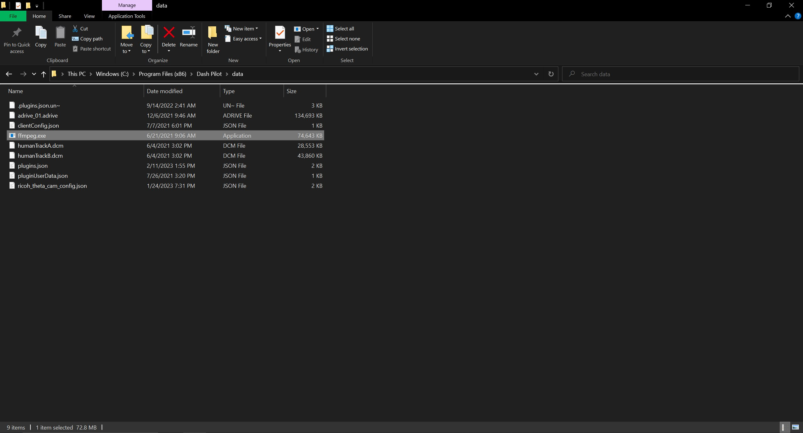

# d.ASH Nav

### Introduction

| { align=center style="width:400px"} |

Welcome to the d.ASH Nav application user guide! Whether you're using a mobile device or computer desktop for robot operations, we've got you covered. For mobile device guide, refer to section 2 in this page. For desktop usage, please turn to section 3.

Now, let's delve into the functionalities that d.ASH Nav offers for seamless robot operations and the respective steps for each of them!

### Table of Contents

1. Application Functions
2. User Guide for *your Mobile Devices*
2. User Guide for *your Computers*

### 1. Application Functionalities

d.ASH Nav is the platform for autonomous control of robots. Being seamlessly integrated in the d.ASH Fleet Management workflow, you can enjoy easy planning and deployment of your robots for various use cases. d.ASH Nav allows you to plot waypoints for autonomous navigation on maps, tracking and monitoring path planning, as well as overall monitoring of your robots.

Because d.ASH Nav is fully integrated with d.ASH Fleet Management system, an internet connection is required. Should you require d.ASH Nav without an internet connection, please contact us for more details.

    
    
Pilot

Our Pilot framework offers high-performance, low-latency, long-range remote operations. It allows you to take manual control of your robots at any time, from any distance, and in any environment.

    
    
Live Video Streaming

Our ultra-high-speed data streaming enables Pilot to stream live video feeds from robots, facilitating operation in environments with weak network infrastructure. Stay connected with minimal latency, you can take control across the country with d.ASH Nav.

    
    
Waypoint Autonomy

d.ASH Nav determines the real-time location of connected robots within millimetres. Just drop and add waypoints like markings on a map to automated patrol routes all thanks to d.ASH Nav’s seamless UI.

    
    
Enhanced Safety and Risk Mitigation

The software’s intelligent decision-making capabilities enable robots to make informed choices to avoid obstacles and optimize their routes, mitigating potential risks and enhancing overall safety. This not only protects the robots themselves but also minimizes the risk of accidents or collisions with humans and other objects in the environment.

### 2. Mobile Devices
This user guide will cover every function in d.ASH Nav Mobile, as well as detailed explanations and necessary steps to take, for operating your robots through your mobile device. 

### 2.1 Setting Up

### 2.2 Installation Guide

#### Recommended System Requirements

### 2.3 Your Account
### 2.3.1 Offline Mode 
---

### 3. Welcome to d.ASH Nav!

After signing into your account, you'll be directed to the main page where you need to load your robot and map files.

| { align=center style="width:1000px"} | 

### 3.1 Connecting to your robot

### 3.1.1 Setting up your robot 

| Instructions |
| ------- | 
| 

1

Turn ON your robot

 For most robots, they are automatically turned ON when you physically attach a battery and press the Power ON button/switch. For robots that need to be turned ON via software (such as the Boston Dynamics Spot), please follow the specific instructions found in the robot manufacturer's website. |
| 

2

Connect to the robot's WiFi network

 Open your mobile device's settings app, click on Connections -> Wi-Fi, and then connect to the network of your robot. After succesful connection, there should be 'Connected without internet' below the Wi-Fi network. If there is no network found, it means your robot has not been turned on properly. |
| 

3

Go back into the application, click on this to select model.

 LMFAO I DONT KNOW WHAT TO WRITE HERE |
| 

4

 
|  Go back into the application, click on this to select model.   |
|  To move the robot **backwards**, pull back on the joystick. |
|  To turn the robot to the **left**, tilt left on the joystick. | 
|  To turn the robot to the **right**, tilt right on the joystick. |
|  To get the robot to **stand** or **sit** ( if the Robot supports it ), click the `stand` or `sit` button under the Basic Control panel on the right side of the main screen. |

### 3.1.2 

<>

#### ^^Robot Power ON/OFF^^
This is an optional step depending on the type of robot you are running. For most robots the robot is automatically turned ON when you physically attach a battery ( or press the actual Power ON button/switch ). For robots that need to be turned ON via software ( like the **Boston Dynamics Spot** ), you should turn it on by pressing the **Power ON** button before piloting the robot. Similary, you can **Power OFF** the robot if it supports such functionality.

---

#### ^^Robot Reconnection/Restart ( Connectivity issues )^^
If you encounter situations where you lose connection to the robot ( or encounter unstable video/control streams ), you should consider **Restarting/Reconnecting** with the robot. There are 2 options available:

| { align=center style="width:200px"} |

- **Reconnect:** This issues a fast reconnection between the pilot client and the robot. Run this if you suspect there was issue with connectivity between the client and the robot.
- **Full Restart:** This will flush + restart the robot system, then reconnect the client to the robot when the robot system is ready. Run this if you need to do a full restart with the robot possibly due to issues other than connectivity.

### 1.4 ^^Control Panel^^

| Control Panel |
| ------- | 
| { align=left style="width:700px"}| 
|  (1)  &nbsp; Unmute the microphone to allow dual-communication between the pilot client and the robot.
|  (2)  &nbsp; Toggle between audio to broadcast speakers. |
|  (3)  &nbsp; Record videos in mp4 format.
|  (4)  &nbsp; Upload/download video recordings.
|  (5)  &nbsp; Configure settings for your preference ie. night mode.
|  (6)  &nbsp; Broadcast live video streaming using either a RTSP server or an HSL server. |

---

### 1.5 ^^Basic Controls^^

| Component | Description |
| ------- | ------- |
| { align=left style="width:200px"} |  (1) &nbsp; Monitor the joystick position with respect to your robot. Control the robot by pushing further on the joystick.    (2) &nbsp; Adjust the cruise control speed using the slider control or if your joystick has a secondary lever, push the lever to activate.    (3)  &nbsp; Activate auto-drive for your robot to switch to Smart AI Assisted Cruise Autonomy.   -  &nbsp; Use the `spacebar` shortcut key to activate auto-drive.    -  &nbsp; Use the `z` shortcut key for your robot to take the next few possible left turns.    -  &nbsp; Use the `x` shortcut key for your robot to return to forward position after turning left or right.    -  &nbsp; Use the `c` shortcut key for your robot to take the next few possible right turns.

---

### 1.6 ^^Cameras^^

| Component | Description |
| ------- | ------- |
| { align=left style="width:1200px"} |  (1) &nbsp; Select from a list of cameras onboard Spot, which are automatically detected by the pilot client.     (2) &nbsp; Adjust the order of cameras for a wider view scope. Ticking the flipped settings will adjust the camera orientation.    (3) &nbsp; Click on sync to sync up the default camera layout/settings from the robot. You can also manually change the camera order via the Cameras drop-down combo box.    (4)  &nbsp; Activate human tracking for people detection and labelling. |

### 1.7 ^^AutoDrive^^

| { align=center style="width:600px"} | 

**AutoDrive** is our state of the art ML/Computer Vision Level 2 Autonomy system for robots. ***It requires a calibrated 3 camera setup*** in order to properly function. Please make sure you have the proper setup before continuing. You can watch an overview video of what **AutoDrive** is capable of [here](https://youtu.be/lj1Q29GCSDw)

| { align=center style="width:200px"} | 

 The following options/controls are available:

- **Run Motors:** This starts/stops the **AutoDrive** system
- **Avoid Grass:** Checking this ON/OFF will tell the system whether to make the robot avoid/ignore a grassy area during Autonomy
- **Log Data:** This will record any required data for sending during operation

### 1.7 ^^Leica BLK360 Laser Scanner^^

| { align=center style="width:200px"} | 

This panel enables you to run scanning with the **Leica BLK360 Laser Scanner**. Please make sure the scanner is properly mounted/connected before proceeding. Run the following steps to start scanning:

1. Type in your Job Name in the textbox. This name will be used for the entire set of scans.
2. Select your Scan quality via the **Quality** combo box.
3. Select whether you want Color ( None, HDR, LDR ) via the **Color** combo box.
4. Click **Start** to start the scanning operation.

### 1.8 ^^Leica RTC360 Laser Scanner^^

| { align=center style="width:200px"} | 

This panel enables you to run scanning with the **Leica RTC360 Laser Scanner**. Please make sure the scanner is properly mounted/connected before proceeding.  Run the following steps to start scanning:

1. Type in your Job Name in the textbox. This name will be used for the entire set of scans.
2. Select your Scan quality via the **Quality** combo box.
3. Check the options **Imaging**, **Double Scan**, **VIS** for your RTC 360. Please consult your scanner user manual for more information on what those options do.
4. Click **Start** to start the scanning operation.

### 1.9 ^^Boston Dynamics Spot Arm^^

| { align=center style="width:200px"} | 

This panel enables you to operate the **Boston Dynamics Spot Arm** if your Spot robot has been configured with one. Please take note that your cameras should be set to **Spot's Default Black and White Cameras** in order for this to function. 

1. Click **Operate** to start the Arm operation
2. This will pop up a separate window that shows the black and white cameras on Spot.
3. Click on the desired target area to run the arm manipulation operation.
4. Click **Run** to start the arm operation.

### 1.10 ^^RTSP Streaming^^
This button allows you to start a RTSP stream which can be used to broadcast camera footage from the robot to clients. [FFMPEG](https://ffmpeg.org/about.html) is required for this feature. However, FFMPEG is not packaged with Dash Pilot. If you would like to use RTSP streaming, please [download FFMPEG here](https://ffmpeg.org/download.html) and move ffmpeg.exe to the Dash Pilot Application's data folder. This is typically located in C:\Program Files (x86)\Dash Pilot.

| { align=center style="width:500px"} | 

There are several settings for customising the RTSP stream.
| { align=center style="width:500px"} |

| Setting | Default Value |
| ------- | ------- |
|  RTSP Channel | Please enter only alphabetical letters |
|  RTSP Server | NIL |
|  RTSP Cam Index | NIL |