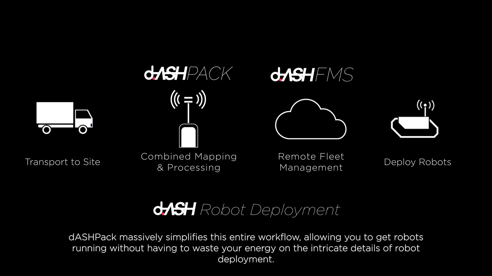

# **d.ASH Pack**

| { align=center style="width:600px"} |

**d.ASH Pack** is a mobile sensor system that allows users to record 3D point cloud data for various applications, including robot autonomous navigation and Digital Twin generation. **d.ASH Pack** can either be worn on the back of the user (just like a backpack) or mounted on a robot. It ships together with **d.ASH Xplorer** application, which is used to generate a 3D point cloud. The entire workflow is fully integrated with [d.ASH Fleet Management system](https://www.dconstruct.co/products).

| { align=center style="width:600px"} |

You can view a short video overview of how **d.ASH Pack** integrates into your Autonomous Robot Deployment workflow [here](https://youtu.be/9q2ROiMkSFI)

## Requirements

- A Windows PC with d.ASH Xplorer
- d.ASH Pack device

*Users can plug in a 4G USB dongle into the side USB port of d.ASH Pack to remotely control it

### 1.1 Quick Start

A 3D point cloud is created in two steps: Data Collection and Data Processing.

Data collection requires the d.ASH Pack device. There are 3 different ways to activate the data collection process, as listed below. If you do not have access to an internet connection, please make sure to use Option 1 which allows you to activate the data collection via your phone.

Data processing requires the [d.ASH Xplorer](https://dconstruct-tech.github.io/dash-sdk/dash-pack/dash-xplorer/) application and an internet connection. The d.ASH Xplorer software is used to process the recorded data, create and edit 3D point clouds, and upload data to the Fleet Management cloud.

Please ensure that others do not stand near the LiDAR while recording as this could cause undesirable results. Also take note that the d.ASH Pack should not undergo large (1 story tall), sudden changes in elevation while recording.

**Recording cannot be paused for later continuation**. If you would like to pause momentarily, please restart the recording. Ensure some overlap in area between the two separate recordings. Do note that the results may not be as accurate as one full walkthrough.

_Loop Closure_ is the act of walking and intersecting paths which you had walked before, an example of this would be walking in the shape of a figure 8, where you meet in the middle and the paths walked intersect one another. _Loop Closure_ is important as it allows for more accuracy during _point cloud generation_. While recording, try to ensure that there is as much _Loop Closure_ as possible.

### 1.2 Connecting to d.ASH Pack

The d.ASH Pack Wi-Fi network SSID and Password will be provided to you on the access panel of the d.ASH Pack itself.

<!-- Insert image here -->

Use this to connect to your d.ASH Pack and access the user interface by keying this IP Address (http://192.168.10.1/) into a web browser from any device of your choice. Users can check the status of their d.ASH Pack and start/stop recordings here.

Mobile interface:
| { align=center style="width:600px"} |

**Status LEDs**
The status LEDs are able to show different colours with each colour representing a different status. These LEDs are located on the side of the d.ASH Pack itself.
**Green LEDs** means that the d.ASH Pack has been booted up fully and is ready for recording.
**Red LEDs** means that something has gone wrong with d.ASH Pack. Use the status reflected in your d.ASH Pack's website to help trouble shoot the error.
**Slow, Flashing Yellow LEDs** mean that the d.ASH Pack is currently recording.

### 1.3 Data Collection

**Option 1 - Connect d.ASH Pack via Wi-Fi Network (No internet connection required)**

1. Power up d.ASH Pack
2. Connect to d.ASH Pack's Wi-Fi network from your phone or other electronic devices.
3. Open your web browser and key in "http://192.168.10.1/".
4. Name your d.ASH Pack recording file and select if you would like imaging (colour) in your scans.
5. Put on the d.ASH Pack and stand stationary for a short moment (e.g. 1s). Then, press start recording.
6. Walk around to cover the area that you would like to record. For better quality, please make sure to walk in loops back to previously visited areas.
7. Once you are done, press stop recording.

**Option 2 - Use d.ASH Xplorer**

1. Power up d.ASH Pack
2. Load your d.ASH Xplorer application on your PC
3. Login with your d.ASH credentials.
4. Click on the "d.ASH Pack Manager" tab at the top.
5. Select your d.ASH Pack.
6. Click on "d.ASH Pack Recording Control"
7. Name your d.ASH Pack recording file and select if you would like imaging (colour) in your scans.
8. Press start
9. Walk around to cover the area that you would like to record. For better quality, please make sure to walk in loops back to previously visited areas.
10. Once you are done, press stop recording.

### 1.4 Data Processing

For a more in-depth guide, please head to the [d.ASH Xplorer documentation page](https://dconstruct-tech.github.io/dash-sdk/dash-pack/dash-xplorer/).

1. Load up the d.ASH Xplorer Application
2. Login and click "d.ASH Pack Manager" tab at the top.
3. Your d.ASH Pack device should appear in the list. Select it by clicking on it.
4. Select the recording files that you wish to download.
5. If you connect an Ethernet cable between d.ASH Pack and your PC, you will have options to download the recordings via either an Ethernet cable or wirelessly. For fast download speeds, using an Ethernet cable is recommended.
6. Change 3D point cloud generation configurations to suite the environment of the recording. For generation configuration explanations/tips, please refer to Generation Configs section in [Xplorer guide](https://dconstruct-tech.github.io/dash-sdk/dash-pack/dash-xplorer/#211-3d-point-cloud-generation).
7. Select the preferred recording file and click "Generate Point Cloud" to start the point cloud generation.
8. While it is running, you will have the following options:
<ul>
    <li><strong>Pause</strong>: Pause the generation process (Appears if generation is running)</li>
    <li><strong>Resume</strong>: Resume the generation process (Appears if generation is paused)</li>
    <li><strong>Cancel</strong>: Cancel the generation process</li>
    <li><strong>Checkpoint</strong>: Export the current 3D point cloud to Point Cloud Editor. This is used to back up the generation progress. If problems arise in the future, some good results can still be restored.</li>
</ul>

9. Once completed, click "Point Cloud Editor" to edit the generated 3D point cloud. The name of the new point cloud is the same as the recording file's name.
10. Follow the [d.ASH Xplorer guide](https://dconstruct-tech.github.io/dash-sdk/dash-pack/dash-xplorer/#22-point-cloud-editor) to edit the point cloud accordingly.
11. Once you are satisfied with the 3D point cloud, click "Upload" to upload the point cloud to your [d.ASH Fleet Management account](https://www.dconstruct.co/products) in the cloud.

### Tips for Data Collection

1. It is recommended to walk in small loops back to previously visited areas for point cloud autocorrection. You will notice some automatic corrections being done during the generation process on d.ASH Xplorer. These corrections are called loop-closures. Walking in the shape of the figure eight is recommended.
2. Where the loops/paths criss-cross should have recognisable static/stationary features (e.g. statues)
3. Tighten the d.ASH Pack straps before recording
4. Move at a steady pace
5. Ensure LiDAR is above your head and do not block the sensor when recording (Stand about 5 metres away from person recording)
6. Do not turn quickly in narrow corridors
7. Do not record while in a lift
8. Not recommended to record in narrow stairwells
9. Put on the d.ASH Pack before starting the scan
10. For recording with imaging, please tilt the LiDAR by 30°. Otherwise a horizontal configuration is recommended
11. If on a vehicle, please dismount and walk through bumpy areas
12. Attempting to loop close long corridors (>20m) is discouraged
13. Avoid large empty areas (e.g. fields) when recording as there are a lack of features
