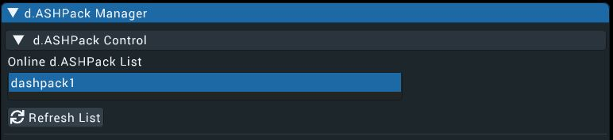
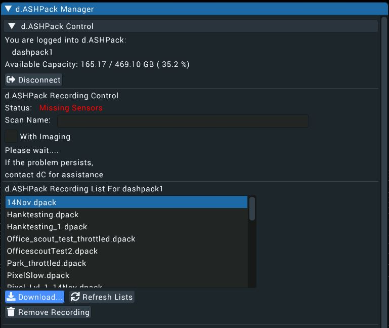
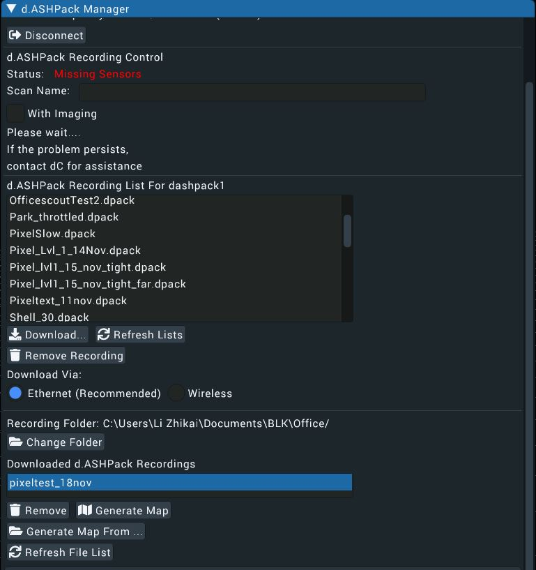
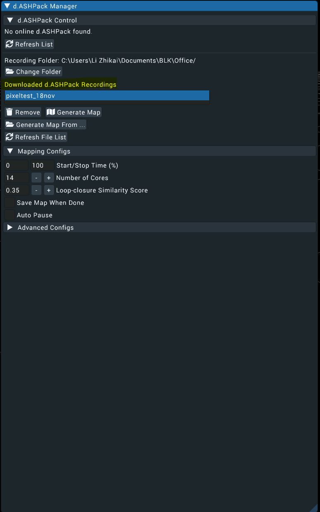
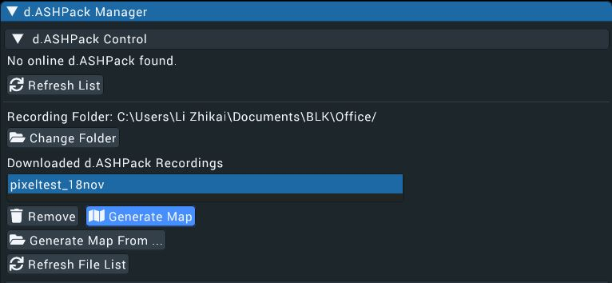
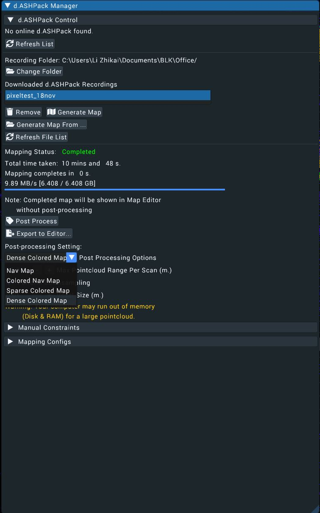

# d.ASH Xplorer
| { align=center style="width:600px"} |

d.ASH Xplorer is *the* 3D point cloud management application, allowing users to create, edit and export 3D maps for robotics autonomy. d.ASH Xplorer is designed to work with d.ASH Pack and equipped with state-of-the-art SLAM technology for 3D map generation. Users can edit the 3D map by rotating, translating, downsampling and cleaning up point clouds for autonomy. 2D maps can also be generated from the 3D point clouds using the built-in grid map generator. The entire map generation workflow is fully integrated with d.ASH Fleet Management to significantly shorten and streamline the preparation process for autonomous navigation.

Two versions of d.ASH Xplorer are available. **d.ASH Xplorer** and **d.ASH Xplorer Pro**.

d.ASH Xplorer Pro is equipped with other add-on features such as the **Scan Manager** which provides scanning support and automatic stitching of dense 3D scans. AutoMerge utilises sensor fusion to perform automatic scan alignment and scale-consistent stitching with little human intervention. The AutoMerge system currently supports the Leica BLK360.

Since d.ASH Xplorer is fully integrated with d.ASH Fleet Management system, an internet connection is required. Should you require d.ASH Xplorer without an internet connection, please [contact us](mailto:hello@dconstruct.ai) for more details.

## Requirements
1. PC with a CPU equivalent to or greater than an Intel I5 11th Gen or AMD R5 5000 series
2. PC with an iGPU^
3. 16GB of RAM
4. Internet Connection^^
5. Windows 10/11

^ We recommend using an Nvidia discrete GPU greater than or equivalent to a GTX 1650 (G5)

^^ Wifi recommended, [contact us](mailto:hello@dconstruct.ai) if you are looking for an offline version

 **d.ASH Xplorer is built for Windows 10/11. Therefore, please ensure you are running a Discrete Nvidia GPU in High Performance mode. Otherwise some functionalities will fail. You can enable this by going into Windows GPU Settings, adding d.ASH Xplorer as an app and setting the "Graphics preference" to "High performance"**.

### Tutorial
| { align=center style="width:600px"} | 

You can watch the video tutorial below to get a quick overview of how to run d.ASH Xplorer above [here.](https://youtu.be/s6JCzOCB8DE)

### 2.1 Modes
d.ASH Xplorer has 2 main modes for various tasks:

1. **Map Editor**: Perform 3D point cloud edit, export and upload

| { align=center style="width:600px"} |

2. **d.ASH Pack Manager**: Control d.ASH Pack and generate 3D point cloud map

| { align=center style="width:600px"} |

**d.ASH Xplorer Pro** also includes:
1. **Scan Manager**: Download and perform AutoMerge on 3rd party 3D scanners.

| { align=center style="width:600px"} |

These 3 modes form 3 different tabs at the top of d.ASH Xplorer.

### 2.2 Map Editor
The map editor is used to manage different point clouds that users have generated. Users can rotate, translate, downsample and preform other 3D point cloud editing features.

You can use this mode to visualize 3D point cloud and 3D mesh by using the **load** button. File extensions ".pcd", ".obj", ".las" and ".e57" are currently supported. We also have our own proprietry file extension ".dcloud" which can be used to load point clouds.

| { align=center style="width:600px"} |

After loading, your 3D objects will appear in the list under **Point Cloud Collections**. You can hide or show a point cloud object by clicking the green eye icon.

| { align=center style="width:600px"} |

The **remove** button simply removes the 3D object from the list. However, it does not delete the file from the PC. 

| { align=center style="width:600px"} |

The **rename** button renames the selected 3D object name.

| { align=center style="width:600px"} |

The **export** button exports the selected 3D object to a destination of your choice. When clicked, a file dialogue will pop up for you to choose the save folder destination. If the 3D object has a mesh, an "obj" file will be exported. On the other hand, if the object has a point cloud, 3 different files will be saved. They are the 3D point cloud (.pcd), 2D map (.png) and map configuration (.json).

| { align=center style="width:600px"} |

The **upload** button uploads the 3D map to d.ASH Cloud Fleet Management System. If a map with the same name is found in the cloud, a warning will pop up and ask the user to either overwrite the existing file or cancel the uploading operation. Once uploaded, users can access or download the map from the cloud.

| { align=center style="width:600px"} |

The **HD View** button allows for high resolution views of the full point cloud data including moving and rotating the point cloud in real time at high frame rates while also being in full colour.

| { align=center style="width:600px"} |

### 2.3 Surface Reconstruction
This feature allows users to perform mesh reconstruction from 3D point cloud. Grid size determines the quality of the scan. Larger grid sizes help to smoothen the mesh at the expense of quality. There is an option to perform a point cloud clean up when performing surface reconstruction. However, this option tends to significantly slow down the meshing process.

When surface reconstruction is running, map removal is disabled. Additionally, users should *not* perform any map transformation because the end mesh product will not be in sync with the mesh itself.

### 2.4 Map Transformation

This feature allows users to perform map editing. Users can perform **translation** and **rotation** by using XYZ and quaternion values respectively. There are options for users to reset the transformations back to the original state. 

In addition, a widget in the center of the screen is designed to facilitate point cloud transformation. Users can click on the widgets and see live transformation of the 3D object. To toggle between translation and rotation mode of the widget, users can choose the right mode under "Edit Mode".

| { align=center style="width:600px"} |

Users can perform downsampling from the same dropdown menu and have the ability to set their desired voxel grid size.

| { align=center style="width:600px"} |

The **Pointcloud Cleaner** helps to remove outliers to make the 3D map cleaner.

| { align=center style="width:600px"} |

### 2.5 2D Map Generator
This feature creates a 2D map from a 3D map by projecting a section of the 3D map to an image file. Users can generate the 2D view from either a *top view perspective* or *side view perspective*. Users have 3 different configuration options: min height, max height and pixel resolution (metre/pixel). To see which region is used for compression, users can check *Show Height-Bounds* to display the minimum and maximum height planes. 

| { align=center style="width:600px"} |

Once satisfied, click **Generate** to apply the configurations and view the 2D map. 

| { align=center style="width:600px"} |

Users can choose to **Save 2D Map** separately if needed.

It is recommended to ensure that the freespace is correctly represented because this information will be used for automatic path-planning and visualization on the website. However, if you do not intent to use d.ASH automatic path-planning, getting a clear 2D map for visualization is sufficient.

### 2.6 d.ASH Pack Manager
This mode allows users to start/stop d.ASH Pack recordings, download d.ASH Pack recordings and generate 3D maps through the *d.ASH Pack Manager* window.

Users can only start/stop d.ASH Pack recordings and download d.ASH Pack recording files when d.ASH Xplorer detects that there are online d.ASH Packs. Otherwise, "No online d.ASH Pack found" will be shown.

| { align=center style="width:600px"} |

If there is an online d.ASH Pack, the d.ASH Pack name will pop up on the list of online d.ASH Pack. Click on it to select the d.ASH Pack device.

### 2.7 d.ASH Pack Control
This section allow users to start/stop d.ASH Pack recordings. 

1. Log in to d.ASH Xplorer
2. If offline, connect to d.ASH Pack Wifi
3. Navigate to the d.ASH Pack Manager 
4. Before starting the recording, ensure d.ASH Pack is powered on and is emitting a **Green** light from the status LED, this represents that d.ASH Pack is ready to be used for recording.
5. In d.ASH Xplorer, key in d.ASH Pack recording name and click the **Start** button.
6. To monitor the recording status, in d.ASH Xplorer, the d.ASH Pack status will reflect **Recording**. On the d.ASH Pack itself, the status light will flash **Yellow**.
7. To stop, click the **Stop** button. Note that user can also force stop via pressing the power button, however, only do this as a last resort by the off chance that the stop button isnt functioning.

### 2.8 Download d.ASH Pack Recordings
After clicking on the list of d.ASH Pack, perform the following steps to download the recording:

| { align=center style="width:600px"}

1. Select the desired d.ASH Pack recording file from the recording list.

| { align=center style="width:600px"}

2. If there is an ethernet connection between the PC running d.ASH Xplorer and d.ASH Pack, users will have options to download either wirelessly or via ethernet. It is recommended to download via ethernet for faster downloading speed.

| { align=center style="width:600px"}

3. Click **Download** to start downloading.
4. Once it is completed, the downloaded file will appear in the *Downloaded d.ASH Pack Recordings* list ready for 3D map generation.

| { align=center style="width:600px"} |

### 2.9 3D Map Generation
After downloading the d.ASH Pack recording, you can then generate the 3D map for that particular recording.

1. Under **Map Configs**, users can choose different settings for the 3D map generation. For details on the configuration, please refer to the next section

| { align=center style="width:600px"} |

2. Select d.ASH Pack recording by clicking on the recording name under the *Downloaded d.ASH Pack Recordings* list.

| { align=center style="width:600px"} |

3. Click **Generate Map** to start the 3D map generation. You will see the 3D map being generated progressively on the screen. A green line appearing on the screen represents the path taken during the recording process.
4. While the 3D map is being generated, users will have the following options:

| { align=center style="width:600px"} |

    <ul>
        <li><strong>Pause</strong>: Pause the mapping process (Appear if mapping is running)</li>
        <li><strong>Resume</strong>: Resume the mapping process (Appear if mapping is paused)</li> 
        <li><strong>Cancel</strong>: Cancel the mapping process</li>
        <li><strong>Checkpoint</strong>: Export the current 3D map to Map Editor. This is used to backup the 3D map in case there are problems later on.</li> 
    </ul>
5. When mapping is completed, the completed map will need to undergo *post processing* so the generated map can be used for specific purposes such as for autonomous navigation or to include dense colour data
6. By clicking on the drop down menu, the option to add *post processing* effects is shown. *Nav Map* is optimised for autonomous movement. Similarly, *Colour Nav Map* is also optimised for this but with colour in the final map. *Dense Coloured Map* creates a point cloud with many points while the *Sparse Coloured Map* creates one with as few points as possible

| { align=center style="width:600px"} |

7. The map will now be automatically added to the map list under *Map Editor* for other purposes such as editing and uploading.

### Mapping Configs
To ensure desirable mapping quality, different settings may be required for different environments and terrains. d.ASH Xplorer is equipped with different preset settings. Users are also allowed to create their own custom settings to suite their requirements. 

Following 3 different presents are embedded in d.ASH Xplorer:

1. **General**: This preset should work for most environment. We recommend using this preset as the first setting for your mapping.
2. **Outdoor**: Suitable for an outdoor environment with large open space, 
3. **Narrow Space**: Suitable for environment with narrow corridors or cluttered space.

**Generate Configuration**

On top of the mapping configurations, users have the following options:

1. **Start/Stop Time(%)**: Users can perform mapping for a part of the d.ASH Pack recording by specifying the start and stop time in percentage (from 0-100%)
2. **Save Map When Done**: When checked, the 3D map will be automatically saved on the PC under `dASH_Xplorer/maps` folder. The absolute path to `dASH_Xplorer` folder depends on the operating system. You can search for the folder using the system native file dialogue.

**Custom Mapping Configurations**

To customise the configurations, please choose **Custom** preset. The following options are avilable:

1. **Number of Cores**: Uses number of cpu cores for parallel computation. It is recommended to be as high as possible
2. **Map Corner Voxel Size**: Determines the accuracy of corners alignment. The lower the value, the more accurate the alignments
3. **Map Surface Voxel Size**: Determines the accuracy of surface alignment. The lower the value, the more accurate the alignments
4. **Keyframe Nearest Radius**: Radius in meter for scan positions to be considered for loop closure.
5. **Keyframe Time Difference**: Time difference in seconds for different scan positions to be considered for loop closure
6. **Keyframe Search Number**: Number of neighbouring scan positions to be merged for loop closure detection.
7. **Keyframe Similarity Score**: Minimum similarity score between different scans to be considered for loop closure.
8. **Surrounding Keyframe Search Radius**: Radius in meter for scan positions optimization.

### Scan Manager (Plugin)
This plugin allows users to manage 3rd-party 3D scanners. Currently, Leica BLK360 scanner is supported. This is currently limited to users of **d.ASH Xplorer Pro**.

This plugin is used to perform the following:
1. Download scanMeta file from the robot
2. Download scan data from the scanner
3. Perform **AutoMerge** on all scans.

**Download ScanMeta Files**

ScanMeta file (`*.scanMeta`) holds critical information for each scan point. Each 3D scan activated by d.ASH robotics stack will generate a ScanMeta file. The ScanMeta data can be used to perform AutoMerge for creating a digital twin (high accuracy/density 3D point cloud model). ScanMeta files are grouped by their project names which are set by d.ASH Autonomy Mission.

To download the ScanMeta files, perform the following:

1. Connect your PC running *d.ASH Xplorer Pro* to the Internet and make sure that the robot is online
2. Login to *d.ASH Xplorer Pro*, then connect to the server.
3. Click on the robot from the *Online Robot List* in the *Scan Manager* tab.
4. Select the desired data folder by clicking **the Folder icon**. This folder will be used to store downloaded ScanMeta files. We recommend choosing an empty folder. Otherwise, some ScanMeta files will be overwritten.
5. Click on *Download Files* to expand the window.

| { align=center style="width:600px"} |

6. Click **Download** to download ScanMeta files for the entire project.

| { align=center style="width:600px"} |

7. After downloading, all ScanMeta files will be stored in the folder selected in Step 3.

**Download 3D Scan Data From the Scanner**

This step performs downloading of 3D scan data from the 3D scanner by using the downloaded ScanMeta files.

1. Connect your PC running *d.ASH Xplorer Pro* to the 3D scanner.
2. Select the desired data folder by clicking **the Folder icon** . This folder should have ScanMeta files.
3. Click on *Download Files* to expand the window.
4. Under "Download scan data from scanner", click **Download**
5. There will be a window popup showing all ScanMeta filenames found in the folder selected in Step 2. If 3D scan files and scanMeta files with the same name exist, the filename will have "[Downloaded]" appended at the back of their names. 
6. Use the check boxes on the left to mark 3D scan data for downloading. Users can use **Select All** or **Unselect All** buttons for file selections. 

| { align=center style="width:600px"} |

7. Click **Download** to start the 3D scan downloading process.
8. Once completed, Click **Close** to close the popup.

**AutoMerge**

This step performs AutoMerge on the 3D Scan data. AutoMerge utilizes sensor fusion techniques to automatically stitch and align multiple 3D scans for scale-consistent digital twin reconstruction. AutoMerge supports both colored and non-colored point cloud. To perform AutoMerge, perform the following steps:

1. Select the desired data folder by clicking **Change** . This folder should have both ScanMeta files and 3D scan data files. 
2. Click on *AutoMerge* to expand the window.
3. *AutoMerge Scan File List* displays a list of files in the selected folder for AutoMerge. Only filenames with `.scanMeta` and `.pcd` are considered for AutoMerge.
4. Since AutoMerge relies on the orientation of the 3D scanner to perform stitching, users are encouraged to preview some scans first. This is done by selecting a few scans (greater than two) and click **Preview**.
5. After scan previews have loaded, expand *Options* and change the **Scanner Rotation** so that the selected scans are roughly aligned. These rotations will rotate the 3D scan about their centers. As the scanner rotation being changed, the 3D scan previews will also be rotated accordingly. Users do not have to perfectly align the 3D scans manually. Just a rough estimate is sufficient.
6. After configuring the scanner rotation, users can start AutoMerge. Click **AutoMerge** to start the AutoMerge process on the selected files (greater than one). You will see the 3D scans popping up and aligning themselves automatically after some time.
7. When AutoMerge has completed, users have the following options:
    <ul>
        <li><strong>Export</strong>: Save the AutoMerge results and individual scans with corrected poses. Users can choose to export as `.pcd`, `.dcloud`, `.las` or `.e57` file formats.</li>
        <li><strong>Edit</strong>: Export the AutoMerge results to <strong>Map Editor</strong> for editing.</li> 
    </ul>

**Options**

There are 3 different options available for Scan Manager:

1. **Scanner Rotation**: Rotation in degrees of the scanner relative to the robot heading. As this value being changed, the 3D scan preview will also be updated in real-time.
2. **Optimize Visualization**: Check this to optimize rendering. Check this if you notice a laggy visualization. 
3. **Auto save AutoMerge results**: Automatically save AutoMerge results to the data folder once AutoMerge has completed.

## Tips
1. **Good Mesh Quality**: It is recommended to downsample the point cloud by using **point cloud Map Details** using a grid size of about 0.1-0.2 metres depending on the quality you would like the point cloud to be. After that, you run **Surface Reconstruction** with a grid size larger than what you used for map details. We recommend using grid size of 0.1-0.2 metres for point cloud Map Details and 1.0 metre for Surface Reconstruction.
