# **d.ASH Xplorer**

| { align=center style="width:600px"} |

*d.ASH Xplorer* is *the* 3D point cloud management application, allowing users to create, edit and export 3D point clouds for the purposes of (but not limited to) Autonomous Navigation and Digital Twin Applications. *d.ASH Xplorer* is designed to work with [d.ASH Pack](https://www.dconstruct.co/products) and equipped with state-of-the-art Simultaneous Localisation And Mapping (SLAM) technology for 3D point cloud generation. Users can view, edit and export the 3D point cloud through the use of *d.ASH Xplorer*. 2D maps can be generated from the 3D point clouds using the built-in grid map generator. The entire point cloud generation workflow is fully integrated with [d.ASH Fleet Management](https://www.dconstruct.co/products) to shorten and streamline the preparation process for autonomous navigation significantly.

Two versions of *d.ASH Xplorer* are available, the standard **d.ASH Xplorer** and **d.ASH Xplorer Pro**.

*d.ASH Xplorer Pro* is a premium edition of the standard *d.ASH Xplorer* offering an additional suite of features not found in the standard edition such as **Scan Manager** and **Auto Merge** which respectively provides scanning support and automatic stitching of dense 3D point clouds, and sensor fusion resulting in automatic scan alignment and scale-accurate stitching, currently supporting the Leica BLK360.

Because *d.ASH Xplorer* is fully integrated with [d.ASH Fleet Management system](https://www.dconstruct.co/products), an internet connection is required. Should you require d.ASH Xplorer without an internet connection, please [contact us](mailto:hello@dconstruct.ai) for more details.

---

## **2.1 Recommended System Specifications**

Due to the resource intensive nature of d.ASH Xplorer, we recommend the following specifications for the operating machine:

| | Minimum | Recommended |
| :-----: | :-----: | :-----: |
| OS | Windows 10 64 bit | Windows 10 64 bit |
| CPU | Intel i5 4XXX / AMD Ryzen 5 2XXX | Intel i7 12XXX / AMD R7 5XXX |
| GPU | Nvidia GTX 960 | Nvidia RTX 3060 |
| Memory | 16 GB | 32 GB |
| Internet Connection | Wi-Fi | Ethernet |

*Some features such as "HD View" are disabled on GPUs prior to Nvidia GTX 960. AMD GPUs are not currently supported*

 **d.ASH Xplorer is built for Windows 10/11. Therefore, please ensure that you are running a discrete Nvidia GPU in High-Performance mode. Otherwise, some functionalities may be unsupported. You can enable this by going into Windows GPU Settings, and adding d.ASH Xplorer as an app and setting the "Graphics preference" to "High performance".**

---

## **2.2 Tutorial**

| { align=center style="width:600px"} |

You can watch the video tutorial to get a quick overview of how to run *d.ASH Xplorer* above [here](https://youtu.be/s6JCzOCB8DE).

**Control Scheme**

*d.ASH Xplorer*'s control scheme is as follows:

- WASD: Navigate around the point cloud
- LMB/MB1: Drag mouse to pan around the point cloud
- RMB/MB2: Drag mouse to zoom in and out
- MMB/MB3: Drag mouse to navigate around the point cloud
- Space: Move upwards(positive) in the Y-axis
- L Ctrl: Move downwards(negative) in the Y-axis
- F: Returns view to origin

Additionally, at the top of the workspace exists a toolbar with buttons that can be clicked.

The grey buttons are fixed buttons focusing on camera control. From left to right, are as follows:

- Set Camera to Origin
- View Along X-Axis
- View Along Y-Axis
- View Along Z-Axis

The buttons in blue are mutable based on the current mode of *d.ASH Xplorer*, for the *Point Cloud Editor* mode, these functions are:
- Show/Hide Grid
- Show/Hide Point Cloud
- Show/Hide Mesh
- Show/Hide Photo360

---

## **2.3 Credit system**

The credit system defines the costs associated with exporting new file from the *d.ASH Xplorer* software (more on [this](#25-dash-xplorer) later).

For every export of a point cloud (*.dcloud* file) to an external file, a price is imposed upon the user's account. The external file can **only** be exported if **the user has met the credit requirements** and **is connected to the internet**.

> **NOTE:** As of April 2023, there is currently no way to top-up credits as a user. Should you need to add additional credits, please [contact us](mailto:hello@dconstruct.ai).

---

## **2.4 Quick Start**

The following section will detail the basic steps needed to generate a point cloud for further processing. Additional features offered by *d.ASH Xplorer* are listed in the subsequent sections.

1. Login to *d.ASH Xplorer*
	
> ***NOTE:*** *d.ASH Xplorer* will automatically log the current user out after one hour of being offline.
1. Launch *d.ASH Xplorer* and click on the *d.ASHPack Manager* tab at the top of the window.
   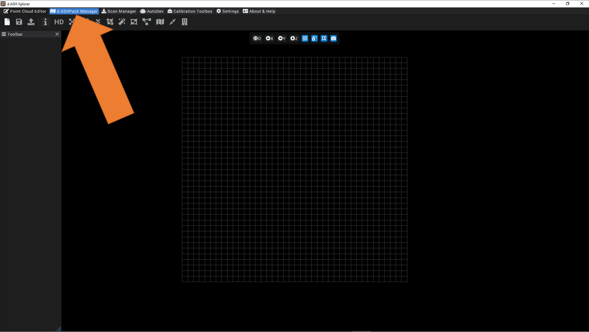
2. Download the *.dpack* recording from a d.ASHPack and click on the *Generate Point Cloud* button.
   
3. When prompted, select the desired *.dpack* file and click *Generate Point Cloud* on the bottom left. 
   >**NOTE:** For the purposes of this quick start guide, we will use the default values for point cloud generation.
   
   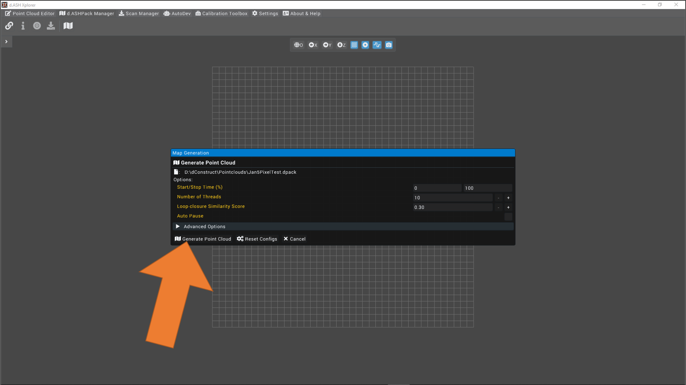
4. Once the map is generated, configure the *Post-processing Settings* by clicking on the *Post-Process* button in the popup that follows
   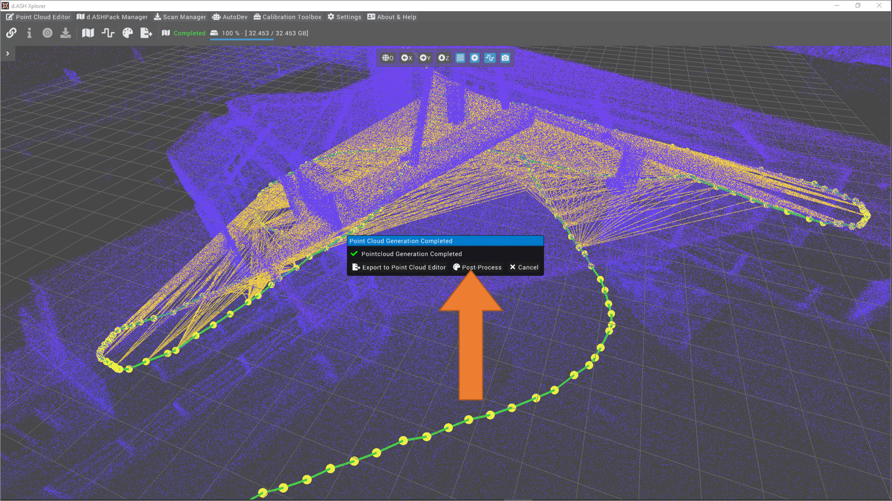
5. The following window will pop up. Configure the post processing as follows and click on *Post Process*.

> **NOTE:** In the current post processing configuration, the "*Human removal*" feature is not active in order to save on processing time. To activate this feature in the future, simply click on the *Activate Dynamic Removal* checkbox.

   
6. Once the post processing completes, click on *Export to Point Cloud Editor*. Enter a desired name and click *Export*.
   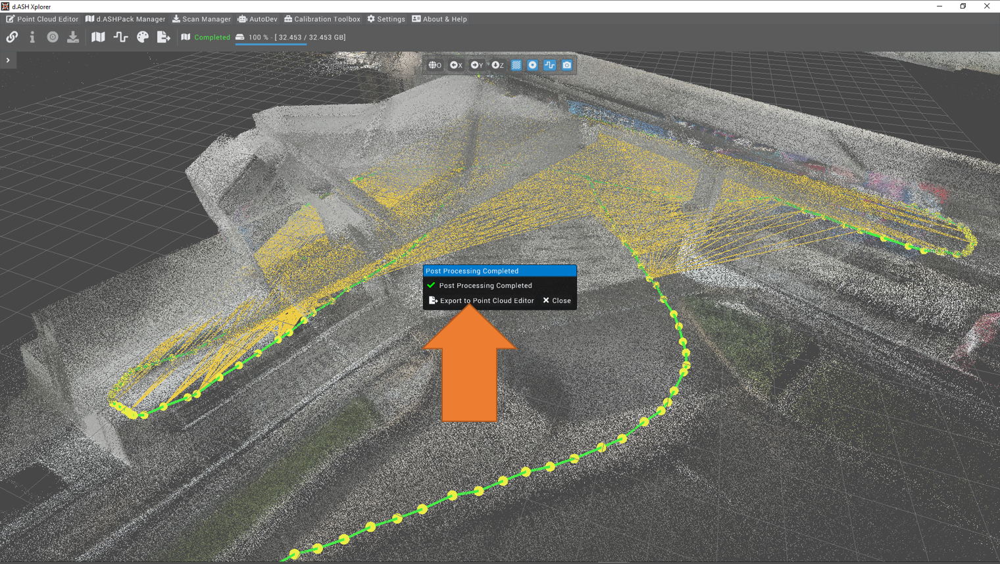
   
7. Click on the *Point Cloud Editor* tab at the top navigation bar to start editing the point cloud

The generated recording can now be used for autonomous navigation with the [d.ASH Fleet Management system](https://www.dconstruct.co/products).

---

## **2.5 d.ASH Xplorer**
*d.ASH Xplorer* provides 2 separate means to load, process and export point clouds, namely the **Point Cloud Editor** and **d.ASH Pack Manager** pages.

### **2.5.1 Point Cloud Editor**
The *Point Cloud Editor* page encompases the main features associated with point cloud manipulation, including the editing of the cloud's rotation, translation and downsampling among other 3D cloud editing features.

The functions offered by the *Point Cloud Editor* (in a left-to-right, top-to-bottom format) are as follows:

#### ***2.5.1.1 Load File***

Allows users to load *.dcloud*, *.pcd*, *.las*, *.e57*, *ply* or *.gltf* files into *d.ASH Xplorer*. When clicked, *d.ASH Xplorer* prompts the user to select a valid file from their system.
>***NOTE:*** No other feature of Point Cloud Explorer is available for use without a valid file loaded and selected. 

#### ***2.5.1.2 Export Files***

  

Allows users to export the currently selected point clouds to the *.dcloud*, *.pcd*, *.las*, *.e57*, *ply* and *.gltf* formats. Export costs differ based on the size of each individual export but cost amount of credits remains the same for all file types.

>***NOTE:*** To export multiple files, hold *ctrl* and click on desired files under the *Loaded File List* section in the *Toolbar* before clicking *Export Files*.

####  ***2.5.1.3 Upload Navigation Map*** 

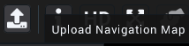  
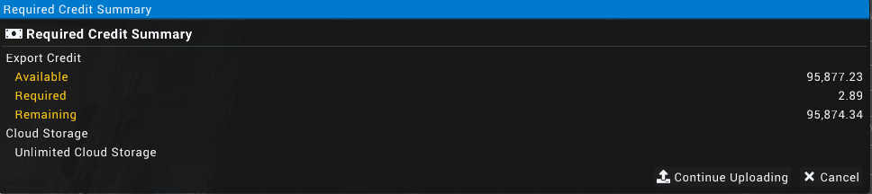

Uploads the selected 3D map to the [d.ASH Cloud Fleet Management System](https://www.dconstruct.co/products). Uploading maps to the cloud costs credits as it exports the selected map in the upload process.

####  ***2.5.1.4 File Info*** 

Displays the selected point cloud's information.
> ***NOTE:*** *File Info* is the default menu that is shown when exiting most functions.

####  ***2.5.1.5 HD View*** 

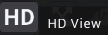

Displays the current point cloud at a high resolution by attempting to render all points within the cloud in full colour. May cause lag when attempting to view large point clouds.
>***NOTE:*** A discrete Nvidia GPU with CUDA capabilities is required for this feature.

####  ***2.5.1.6 Translation and Rotation*** 

Allows users to edit the translation and rotation data of the point cloud using the respective XYZ and quaternion values of the point cloud as an object.

Adjustment of these values is done through one of two methods:

- A widget panel within the Toolbar
  
  

- A gizmo found on or near the point cloud generation in the main workspace
  
  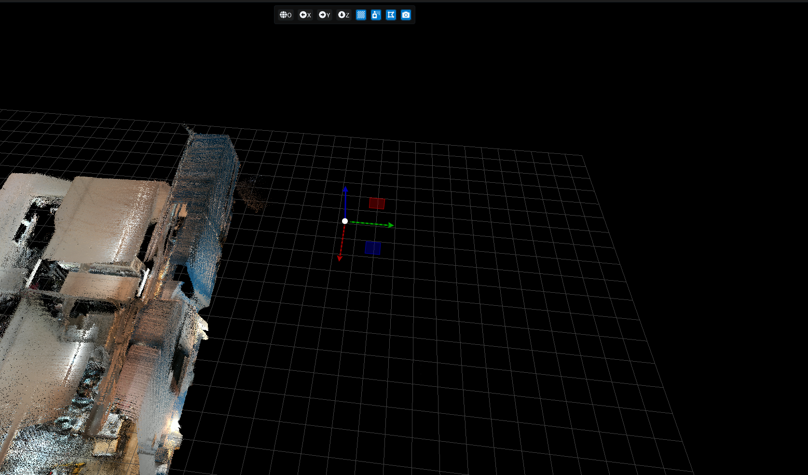

####  ***2.5.1.7 Point Cloud Aligner*** 

Does a "best fit" alignment of any two selected point clouds.

To align the point clouds, click the *Point Cloud Aligner* button and swap the point clouds (if necessary) and click the *align* icon. (Icons from left to right are: *Align Point Cloud*, *Swap Point Cloud*, *Exit*).

>***NOTE:*** *Point Cloud Aligner* is not available if only a single point cloud is selected. To select more than one point cloud, hold *ctrl* and click on the desired point clouds in the *Loaded File List* widget.

####  ***2.5.1.8 Point Cloud Downsample*** 

Allows the user to reduce the number of points within the selected point cloud using the *Downsample Grid Size* option as a reference

The options for the downsampling include:

- **Downsample**: Executes the down sampling
- **Reset to Original**: Resets the downsampled point cloud to it's state before downsampling
- **Exit**: Exits the downsampling tool and display the current selected point cloud's information

####  ***2.5.1.9 Point Cloud Cropper*** 

Allows the user to crop an area within the currently selected point cloud.
The user can specify the exact area of the selected point cloud to crop through the widget panel by either entering the numbers or clicking and dragging on the textbox.

*Visualise Cropping Bounds* allows for a priview of the area to be cropped, surrounding the cropped area with a white box, *Keep points outside bounds* which specifies whether the point clouds outside of the specified ranges should be kept after the cropping is complete and *Create a Copy* creates a separate point cloud for the cropped point cloud instead of overwriting the selected cloud.

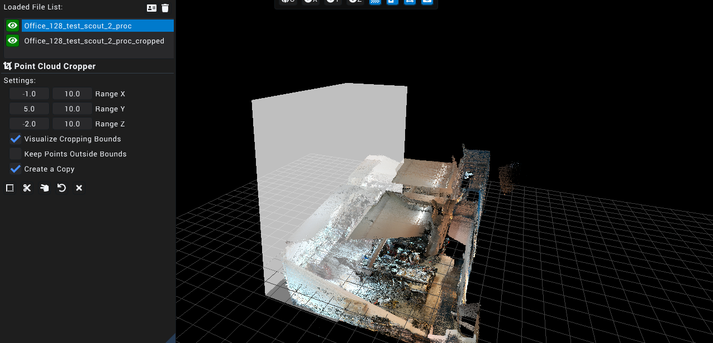

Lastly, the options for the cropper include:

- **Auto Set Crop Ranges**: Sets the range automatically based on the 3D point cloud
- **Crop**: Executes the cropping using the specified crop ranges
- **Split**: Creates two separate point clouds, an inside which is the area within the specified ranges, and an outside, which is the remainding area after the inside has been generated
- **Reset Crop**: Resets the currently selected crop area
- **Exit**: Exits the cropping tool and displays the selected point cloud's information in the toolbar

####  ***2.5.1.10 Point Cloud Denoiser*** 

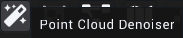

The point cloud denoiser aims to remove outlier points and smoothen the selected point cloud.

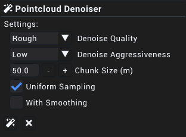

The features of the point cloud denoiser include:

- **Denoise Quality**: Selector to specify the number of iterations the denoise algorithm will run, wherein the default setting is *Rough*. In the above image, the quality is set to *Refined*, respectively indicating that the denoise algorithm will run at an increased quantity, resulting in a more accurate final point cloud output.
- **Denoise Aggressiveness**: Used to determine how the algorithm should treat infracting points, wherein a higher setting results in the removal and shifting of more points while the opposite holding true for lower settings.
- **Chunk Size (m)**: Specifies the volume by which the equally sized chunks of the point cloud is split for denoising.
  > ***NOTE:*** Setting the chunk size to a high value may result in instabilities and/or crashing.
- **Uniform Sampling**: Specifies wheter inferential surfaces in the point cloud should be accentuated. This setting should be switched off should shapes in the point cloud appear distorted.
- **With Smoothing**: Specifies whether points within the cloud should be shifted in order to make surfaces more pronounced. Disable this option if distortions are observed within the point cloud.

####  ***2.5.1.11 Point Cloud Merger*** 

Attempts to merge all selected point clouds.

The only setting for the point cloud merger is for the name of the new point cloud created post merge. The two buttons are *Merge Point Cloud* which executes the merge and *Exit*.
>***NOTE:*** *Point Cloud Merger* is not available if only a single point cloud is selected. To select more than one point cloud, hold *ctrl* and click on the desired point clouds in the *Loaded File List* widget.

####  ***2.5.1.12 Point Cloud to Mesh*** 

Converts and exports the currently selected point cloud into a mesh, exported as either a *.PLY* or *.GLTF* format.

The settings found in the toolbar for this feature are as follows:

- **Set Mesh Output Location**: Allows the user to specify the desired output location of the mesh.
- **Export Format**: Determines the output file format (*.PLY* or *.GLTF*)
- **Level of Detail**: Specifies the density of the vertex mesh, with a higher setting resulting in more details but a larger output file size and vice versa
- **Clean Up Level**: Specifies the tolerance by which outlier points should be removed, wherein a higher value removes more points.
  > ***NOTE:*** When set to high values, unintentional removal of points may occur, lowering the value lower may remedy this issue
- **Smoothing Cycles**: Determines the number of cycles used in the meshing algorithm. Setting a higher value will result in a smoother mesh but may be slower than the alternative.
- **Level of Sub-Details**: Determines the value of details within a local scope. Setting a high value may result in a considerable increase in size as compared to a lower value.
- **Color Smoothing Quality**: Determines the smoothness of colours that appear on the final mesh where a higher value results in a smoother color but may take a longer time as compared to alternative options.
- **Point Simplification**: Option to simplify the original file before being processed for meshing by removing outlying or redundant points
- **3D Engine Compatible**: Option to take viewing the final exported in a three-dimensional engine such as the Unity or Unreal game engines into consideration.

Lastly, the buttons at the bottom of the toolbar widget are *Start*, which executes the conversion and export, and *Exit*, which reverts the toolbar widget view to the *File Info*.

####  ***2.5.1.13 2D Map Generator*** 

Creates a 2-dimensional map of the point cloud through projecting the specified section of the point cloud to an image file using a top-down perspective.

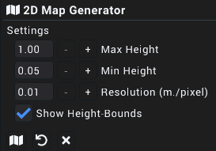

The configuration options for the generator area are as follows:

- **Max Height**: The highest point that will be captured in the map generation
- **Min Height**: The lowest point that will be captured in the map generation
- **Resolution (m./pixel)**: The number of meters per pixel of the 2 dimensional capture of the selected point cloud
- **Show Height Bounds**: Visualises the highest and lowest points that will be captured using translucent planes

Additionally, the three options that are present at the bottom of the toolbar widget are: *Generate*, which executes the two-dimensional map generation, *Reset Config*, which resets the configuration settings to their default values and *Exit*, which reverts the toolbar widget view to the *File Info*.

####  ***2.5.1.14 Point Cloud Comparison*** 

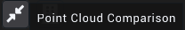

Highlights and displays selected point clouds in contrasting colours, where red is shown to be the points removed from the first selected point cloud relative to the second selected point cloud, green is the colour of the points added to the first selected point cloud and blue is the colour of the points that remain unchanged between the two point clouds. The settings found within the Toolbar are as follows:

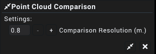

**Comparison Resolution**: Determines the accuracy to be considered for the comparison in meters

**Compare**: Executes the comparison

**Exit**: Exits the cropping tool and displays the selected point cloud's information in the toolbar

The results of the comparison are shown below:

***Before***

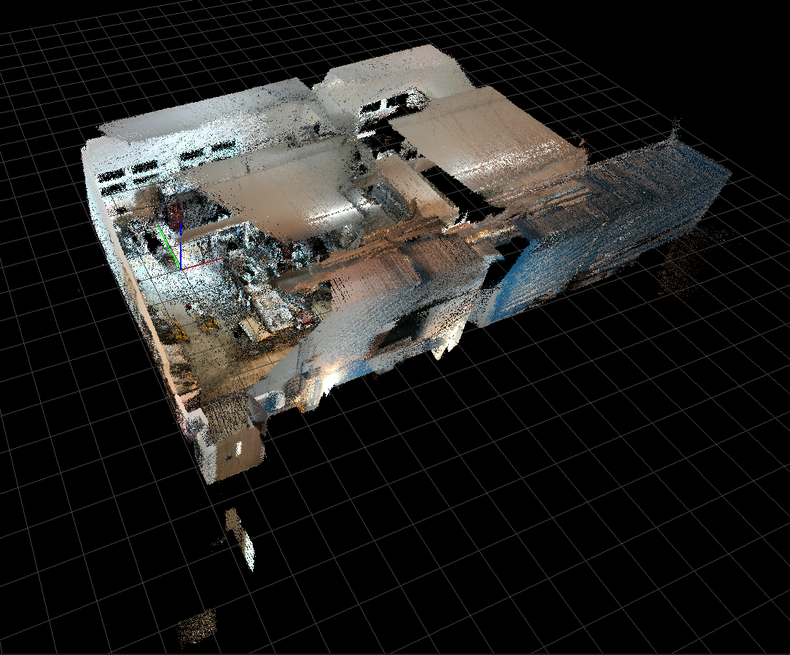

***After***

As seen from the pictures above, the point clouds are compared using red, blue and green (*not shown here*) colours to represent removed points, unchanged points and added points respectively.

> ***NOTE:*** *Point Cloud Comparison* is **ONLY** available for use if exactly **TWO** point clouds are selected.

####  ***2.5.1.15 BIM Manager*** 

>***WORK IN PROGRESS***

### **2.5.2 d.ASHPack Manager**
*d.ASHPack Manager* mode provides an easy and convenient way to interface with a valid *d.ASHPack* system, including the downloading and processing of the files found within a *d.ASHPack*.

The toolbar found on the workspace has also changed, wherein the mutable buttons (blue buttons) have changed in functionality. The blue buttons now have the following functionality (from left to right):

- Show Grid
- Hide Keyframe Poses
- Hide Constraints
- Hide Photo360 Poses

The functions offered by the d.ASHPack Manager (in a left-to-right, top-to-bottom format) are as follows:

####  ***2.5.2.1 Connect to a d.ASHPack*** 

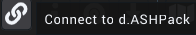

Attempts to connect to a visible *d.ASHPack* either through the devices' Ethernet port or through a connection with the *d.ASHPack*'s hotspot.

Upon clicking the button, a window is displayed for the user to select the *d.ASHPack* that they wish to connect to if there are *d.ASHPack*s available.

Upon seeing the window, clicking on the name of the desired *d.ASHPack* will connect *d.ASH Xplorer* to it. After a connection has been established, the *Connect to a d.ASHPack* icon will change to its disconnect counterpart. Clicking it will disconnect the currently connected d.ASHPack.

>***NOTE:*** If no *d.ASHPack* is currently connected, the *About d.ASHPack*, *d.ASHPack Scan Control* and *Download d.ASHPack recording* buttons will be disabled.

####  ***2.5.2.2 About d.ASHPack*** 

Displays a window to show information on the currently connected *d.ASHPack*.

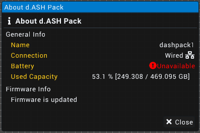

####  ***2.5.2.3 d.ASHPack Scan Control*** 

Displays a window to allow the user to start a recording on the currently connected *d.ASHPack*.

Shows the user the current status of the connected *d.ASHPack* with an input field for the desired recording name below the status display. *With Imaging* allows the recording to capture colour data via the mounted camera beside the LiDAR module on the *d.ASHPack*.
>***NOTE:*** Should the *Recording Name* field be left blank, the recording will be named as the current date and time in the format of `YYYY-MM-dd_HH-mm-ss.dpack` (E.g. 2023-12-31_23-59-58.dpack).

####  ***2.5.2.4 Download d.ASHPack Recording*** 

Opens a window that allows the user to view, search for, download and remove any recording that is saved on the currently connected *d.ASHPack*'s on-board storage.

As shown above, the window provides a search bar and refresh button to refresh or search for a desired *.dpack* file contained within the on-board memory of the currently connected d.ASHPack. To perform an action, first click on the desired *.dpack* file to select it and then on either the *Download* or *Remove Recording* buttons. Clicking *Download* will prompt the user to specify a download path while clicking *Remove Recording* will prompt for a confirmation to remove the selected recording.

####  ***2.5.2.5 Generate Point Cloud*** 

When clicked, the user will be prompted to select the *.dpack* file that they wish to use to generate a point cloud. Afterwhich, a *Map Generation* window will appear, providing several configuration options.

The main options listed in the *Map Generation* window are as follows:

- **Start/Stop Time (%)**: The percentage of the d.ASHPack scan to generate a point cloud from. (E.g from 10% to 50% of a scan)
- **Number of Threads**: Specifies number of threads to be used for the point cloud generation operation. More threads are favoured but may cause a performance decrease in other applications.
- **Loop-closure Similarity Score**: Specifies the tolarance for loop closures (ie. lower values equate to stricter the program becomes when finding similar points).
- **Auto Pause**: The generation operation will automatically be paused when a significant change in position is detected. This option is used in cases where point cloud generation may fail to allow for the back up of the data that has already been generated.

Advanced options are listed as follows:

- **Loop-closure Search Radius (m)**: Value used for automatic loop closure detection, where points within the stipulated radius are considered for loop closure.
- **Loop-closure Minimum Time Difference (s)**: States the time that must pass before potential points are considered for loop closure.
- **Scan-matching Sub-map Search Radius**: Controls the neighbouring distance from the current pose inwhich scan matching is done during scan to map matching.
- **Minimum Keyframe Distance Difference**: Determines the minimum distance between each LiDAR scan to be used for mapping.
- **Minimum Keyframe Angle Difference**: Determines the minimum angular displacement between each LiDAR scan to be used to mapping
- **Fast Mode**: Specifies whether to use singular or multiple threads for point cloud generation. Pragmatically results in faster generation but may reduce map quality, particularly in complex areas with little features such as that of buildings.
- **Scan Context Loop Closure**: Specifies whether to utilise an advanced loop closure algorithm. Results in more scan positions being considered for loop closure which results in a higher quality map but may use more system resources.

####  ***2.5.2.6 Manual Loop Closure*** 

Manual Loop Closure allows for the manual stitching and combination of points within a generated point cloud. This function serves to allow for manual override of loop closures (a pair of keyframes with similar locations) in the event that the points within a point cloud fail to be merged by the algorithm. This is done through attempting to pair every point at each selected keyframe  with each other in all possible permutations.

The options available when performing a *Manual Loop Closure* operation are as follows:

**Selected Keyframe List**: (*Only shown if there are Keyframes selected*) Displays a list of keyframes and their relation to their neightbours if *Add Neighbour Keyframes* is enabled, otherwise will only display selected keyframes and their relation to each other.

**Max Similarity Score**: Determines the tolarance to be used during consideration of points to be paired with each other

**Neighbour Size** (Only if *Add Neighbour Keyframes* is enabled): The number of keyframes to the left and right of the selected keyframes to be selected

**Add Neighbour Keyframes**: Specifies whether to select all keyframes that are to the left and right of the two currently selected keyframes as specified by the *Neighbour Size* option.

The following will be a demonstration of a *Manual Loop Closure* operation:

For the purposes of demonstration, the center points are the closest in the preceeding image and will be used. After selecting *Manual Loop Closure* from the mode bar and clicking the keyframes, the selected keyframes will be highlighted.

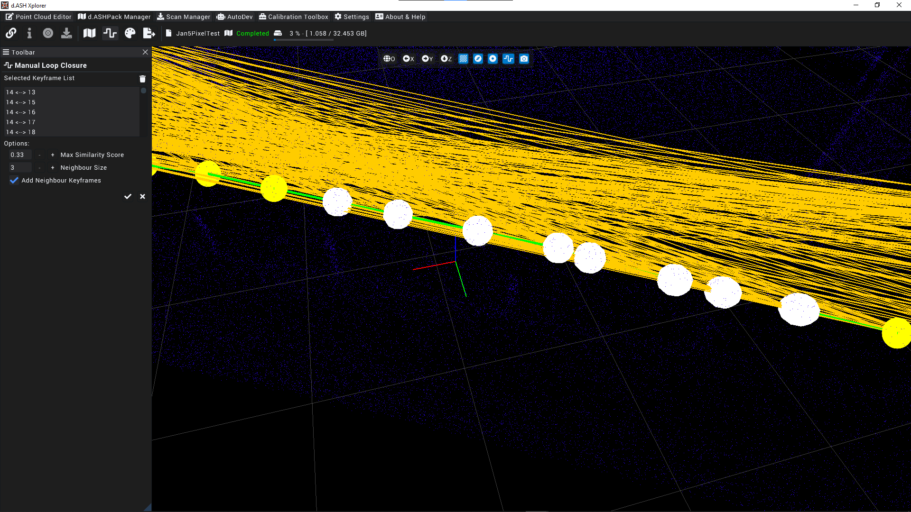

Lastly, after clicking the check mark in the toolbar will execute the loop closure operation.

####  ***2.5.2.7 Post Processing*** 

After the generation of a point cloud, the user may choose to post process the point cloud in order to refine the result. The *Post Process Point Cloud* menu enables this by allowing for more granular control over the generated point cloud.

In the following screenshot, the *Activate Dynamic Removal* box is not checked.

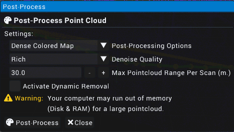

The options displayed are as follows:

**Post-Processing Options**:

- *Nav Map*: Autonomous Navigation Map meant for waypoint plotting for a compatible robot
- *Colour Nav Map*: A *Nav Map* with colours
- *Sparse Coloured Map*: A coloured point cloud with as few points as possible
- *Dense Coloured Map*: A coloured point cloud with all available points

**Denoise Quality**:

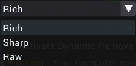

- *Rich*: Most aggresive denoise of the generated point cloud
- *Sharp*: Moderate denoising of the generated point cloud
- *Raw*: No denoising of the generated point cloud

**Max Point Cloud Range Per Scan (m.)**

Determins the distance from the origin where points will be considered and added to the final, post-processed cloud. Increasing this value is recommended for point clouds of wider areas, especially scans of outdoor areas.

**Activate Dynamic Removal**:

Dynamic removal refers to the automatic removal of objects and/or artifacts through an internal algorithm of *d.ASH Xplorer*. Objects considered for removal include (but may not be limited to) pedestrians, cars and animals.

Checking the box presents the user with two new options. These are as follows:

**Use GPU for Inference**: Specifies whether the Graphics Processing Unit on the device running *d.ASH Xplorer* should be utilised. It is recommended to leave this option enabled for most situations.

**Point Removal Level**: Specifies the extent of which points around moving objects should be removed.

---

## **2.6 d.ASH Xplorer Pro**
*d.ASH Xplorer* Pro provides additional features that allow for more granular control over generated point clouds, providing the aforementioned features mentione above, along with a *Scan Manager* and *AutoMerge* feature.

### **2.6.1 Scan Manager**
*Scan Manager* allows users to manage third-party 3D scanners and integrate them with *d.ASH Xplorer*. As of *April 2023* only the *Leica BLK360* 3D scanner is supported.

*Scan Manager* serves the following purposes:
1. Downloading *.scanMeta* files from the *d.ASHPack*
2. Downloading scan data from a scanner
3. Performing [AutoMerge](#262-automerge) on scans

####  ***2.6.1.1 Downloading*** **.scanMeta** ***files*** 

>***UPDATE WORK IN PROGRESS, PLEASE REFER TO THE CURRENT DOCUMENTATION OF [SCAN MANAGER](#scan-manager-plugin).***

####  ***2.6.1.2 Generate Point Cloud*** 

>***UPDATE WORK IN PROGRESS, PLEASE REFER TO THE CURRENT DOCUMENTATION OF [SCAN MANAGER](#scan-manager-plugin).***

### **2.6.2 AutoMerge**

>***UPDATE WORK IN PROGRESS, PLEASE REFER TO THE CURRENT DOCUMENTATION OF [SCAN MANAGER](#scan-manager-plugin).***

## **Scan Manager (Plugin)**

This plugin allows users to manage 3rd-party 3D scanners. Currently, the Leica BLK360 scanner is supported. This is currently limited to users of **d.ASH Xplorer Pro**.

This plugin is used to perform the following:

1. Download scanMeta files from the robot
2. Download scan data from the scanner
3. Perform **AutoMerge** on all scans.

**Download ScanMeta Files**

scanMeta file (`*.scanMeta`) holds critical information for each scan point. Each 3D scan activated by the d.ASH robotics stack will generate a scanMeta file. The scanMeta data can be used to perform AutoMerge for creating a digital twin (high accuracy/density 3D point cloud model). scanMeta files are grouped by their project names which are set by d.ASH Autonomy Mission.

To download the scanMeta files, perform the following:

1. Connect your PC running *d.ASH Xplorer Pro* to the Internet and make sure that the robot is online
2. Log in to *d.ASH Xplorer Pro*, then connect to the server.
3. Click on the robot from the *Online Robot List* in the *Scan Manager* tab.
4. Select the desired data folder by clicking **the Folder icon**. This folder will be used to store downloaded scanMeta files. We recommend choosing an empty folder. Otherwise, scanMeta files from previous/other projects will be overwritten.
5. Click on *Download Files* to expand the window.

| { align=center style="width:600px"} |

6. Click **Download** to download ScanMeta files for the entire project.

| { align=center style="width:600px"} |

7. After downloading, all ScanMeta files will be stored in the folder selected in Step 3.

**Download 3D Scan Data from the Scanner**

This step performs downloading of 3D scan data from the 3D scanner by using the downloaded ScanMeta files.

1. Connect your PC running *d.ASH Xplorer Pro* to the 3D scanner.
2. Select the desired data folder by clicking **the Folder icon** . This folder should have ScanMeta files.
3. Click on *Download Files* to expand the window.
4. Under "Download scan data from scanner", click **Download**
5. There will be a window popup showing all ScanMeta filenames found in the folder selected in Step 2. If 3D scan files and ScanMeta files with the same name exist, the filename will have "[Downloaded]" appended at the back of their names.
6. Use the checkboxes on the left to mark 3D scan data for downloading. Users can use **Select All** or **Unselect All** buttons for file selections.

| { align=center style="width:600px"} |

7. Click **Download** to start the 3D scan downloading process.
8. Once completed, Click **Close** to close the popup.

**AutoMerge**

This step performs AutoMerge on the 3D Scan data. AutoMerge utilizes sensor fusion techniques to automatically stitch and align multiple 3D scans for scale-consistent digital twin reconstruction. AutoMerge supports both colored and non-colored point clouds. To perform AutoMerge, perform the following steps:

1. Select the desired data folder by clicking **Change**. This folder should have both ScanMeta files and 3D scan data files.
2. Click on *AutoMerge* to expand the window.
3. *AutoMerge Scan File List* displays a list of files in the selected folder for AutoMerge. Only filenames with `.scanMeta` and `.pcd` are considered for AutoMerge.
4. Since AutoMerge relies on the orientation of the 3D scanner to perform stitching, users are encouraged to preview some scans first. This is done by selecting a few scans (greater than two) and clicking **Preview**.
5. After scan previews have loaded, expand *Options* and change the **Scanner Rotation** so that the selected scans are roughly aligned. These rotations will rotate the 3D scan about their centres. As the scanner rotation is changed, the 3D scan previews will also be rotated accordingly. Users do not have to perfectly align the 3D scans manually. Just a rough estimate is sufficient.
6. After configuring the scanner rotation, users can start AutoMerge. Click **AutoMerge** to start the AutoMerge process on the selected files (greater than one). You will see the 3D scans popping up and aligning themselves automatically after some time.
7. When AutoMerge has completed, users have the following options:
    <ul>
        <li><strong>Export</strong>: Save the AutoMerge results and individual scans with corrected poses. Users can choose to export as `.pcd`, `.dcloud`, `.las`, or `.e57` file formats.</li>
        <li><strong>Edit</strong>: Export the AutoMerge results to <strong>Map Editor</strong> for editing.</li>
    </ul>

**Options**

There are 3 different options available for Scan Manager:

1. **Scanner Rotation**: Rotation in degrees of the scanner relative to the robot heading. As this value is changed, the 3D scan preview will also be updated in real-time.
2. **Optimize Visualization**: Check this to optimize rendering. Check this if you notice a laggy visualization.
3. **Auto save AutoMerge results**: Automatically save AutoMerge results to the data folder once AutoMerge has completed.