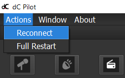

# dC Pilot Client

The dC pilot is a GUI (graphical user interface) for the d.ASH SDK. It encompasses interactive visual components for you to control your robot both manually and autonomously. Operate your robots safely and precisely, from any location with our reliable and high-performance  BVLOS (Beyond Vision Line of Sight) System with high quality video streams and responsive controls. This section of the d.ASH SDK documentation provides details about using the d.C Pilot Client.

--- 
### 1.1 Introduction

| { align=center style="width:400px"} |

The pilot client allows you to operate your robots safely and precisely, from any location via its high-performance **Remote TeleOps/BVLOS (Beyond Vision Line of Sight)** system. It is also equipped with high quality video streams and responsive controls for seamless naviation. The system can also be used for fleet management, to discover, monitor and control multiple robots anytime, anywhere with real time video streaming and data collection. You can view a quick introduction of **dc Pilot** [here](https://youtu.be/3IDTwf2jsXg)

| { align=center style="width:400px"} |

The **Vision AutoDrive** is another key feature of the d.C Pilot, using machine learning and computer vision to analyze and understand your robot's surroundings. This allows hands-free Level 2 Autonomy for the navigation of complex, unstructured environments using just cameras alone.  A demonstration of what **Vision AutoDrive** is capable of can be viewed [here](https://youtu.be/tcDHD-49bo0)

Some requirements before starting the d.C Pilot are: 

1. Nvidia CUDA GPU enabled PC ( At least 2 GB of GPU Memory )
2. Joystick connected to the PC
3. 1 GB local storage space
4. 16 GB of CPU Memory
5. Intel i5 CPU or equivalent
6. Windows 10 64-bit OS or higher

### 1.2 Robot Login

When you first load up the pilot client, you will be asked to login via your user account. After authentication, you will be presented with the following screen below:

| { align=center style="width:400px"} | 

The screen above shows you the robots switched ON and discovered via **dashBoard** ( the Fleet Management System ). Any robot currently registered under your user account and is alive will be displayed. Select the robot you want and click on **Take Control** to proceed to control the robot. If you want to restart the robot ( due to any unforseen previously encountered issues, ), click **Restart** to do so.

---

### 1.3 ^^Main Controls^^
| { align=center style="width:1000px"} | 
#### ^^Robot Power ON/OFF^^
This is an optional step depending on the type of robot you are running. For most robots the robot is automatically turned ON when you physically attach a battery ( or press the actual Power ON button/switch ). For robots that need to be turned ON via software ( like the **Boston Dynamics Spot** ), you should turn it on by pressing the **Power ON** button before piloting the robot. Similary, you can **Power OFF** the robot if it supports such functionality.

| Basic Manual Piloting |
| ------- | 
|  To **start** the robot from rest, apply pressure on the joystick. |
|  To **stop** the robot from moving, release your hold on the joystick. | 
|  To move the robot **forwards**, push front on the joystick. |
|  To move the robot **backwards**, pull back on the joystick. |
|  To turn the robot to the **left**, tilt left on the joystick. | 
|  To turn the robot to the **right**, tilt right on the joystick. |
|  To get the robot to **stand** or **sit** ( if the Robot supports it ), click the `stand` or `sit` button under the Basic Control panel on the right side of the main screen. |
---

#### ^^Robot Reconnection/Restart ( Connectivity issues )^^
If you encounter situations where you lose connection to the robot ( or encounter unstable video/control streams ), you should consider **Restarting/Reconnecting** with the robot. There are 2 options available:

| { align=center style="width:200px"} |

- **Reconnect:** This issues a fast reconnection between the pilot client and the robot. Run this if you suspect there was issue with connectivity between the client and the robot.
- **Full Restart:** This will flush + restart the robot system, then reconnect the client to the robot when the robot system is ready. Run this if you need to do a full restart with the robot possibly due to issues other than connectivity.

### 1.4 ^^Control Panel^^

| Control Panel |
| ------- | 
| { align=left style="width:700px"}| 
|  (1)  &nbsp; Unmute the microphone to allow dual-communication between the pilot client and the robot.
|  (2)  &nbsp; Toggle between audio to broadcast speakers. |
|  (3)  &nbsp; Record videos in mp4 format.
|  (4)  &nbsp; Upload/download video recordings.
|  (5)  &nbsp; Configure settings for your preference ie. night mode.
|  (6)  &nbsp; Broadcast live video streaming using either a RTSP server or an HSL server. |

---

### 1.5 ^^Basic Controls^^

| Component | Description |
| ------- | ------- |
| { align=left style="width:200px"} |  (1) &nbsp; Monitor the joystick position with respect to your robot. Control the robot by pushing further on the joystick.    (2) &nbsp; Adjust the cruise control speed using the slider control or if your joystick has a secondary lever, push the lever to activate.    (3)  &nbsp; Activate auto-drive for your robot to switch to Smart AI Assisted Cruise Autonomy.   -  &nbsp; Use the `spacebar` shortcut key to activate auto-drive.    -  &nbsp; Use the `z` shortcut key for your robot to take the next few possible left turns.    -  &nbsp; Use the `x` shortcut key for your robot to return to forward position after turning left or right.    -  &nbsp; Use the `c` shortcut key for your robot to take the next few possible right turns.

---

### 1.6 ^^Cameras^^

| Component | Description |
| ------- | ------- |
| { align=left style="width:1200px"} |  (1) &nbsp; Select from a list of cameras onboard Spot, which are automatically detected by the pilot client.     (2) &nbsp; Adjust the order of cameras for a wider view scope. Ticking the flipped settings will adjust the camera orientation.    (3) &nbsp; Click on sync to sync up the default camera layout/settings from the robot. You can also manually change the camera order via the Cameras drop-down combo box.    (4)  &nbsp; Activate human tracking for people detection and labelling. |

### 1.7 ^^AutoDrive^^

| { align=center style="width:600px"} | 

**AutoDrive** is our state of the art ML/Computer Vision Level 2 Autonomy system for robots. ***It requires a calibrated 3 camera setup*** in order to properly function. Please make sure you have the proper setup before continuing. You can watch an overview video of what **AutoDrive** is capable of [here](https://youtu.be/lj1Q29GCSDw)

| { align=center style="width:200px"} | 

 The following options/controls are available:

- **Run Motors:** This starts/stops the **AutoDrive** system
- **Avoid Grass:** Checking this ON/OFF will tell the system whether to make the robot avoid/ignore a grassy area during Autonomy
- **Log Data:** This will record any required data for sending during operation

### 1.7 ^^Leica BLK360 Laser Scanner^^

| { align=center style="width:200px"} | 

This panel enables you to run scanning with the **Leica BLK360 Laser Scanner**. Please make sure the scanner is properly mounted/connected before proceeding. Run the following steps to start scanning:

1. Type in your Job Name in the textbox. This name will be used for the entire set of scans.
2. Select your Scan quality via the **Quality** combo box.
3. Select whether you want Color ( None, HDR, LDR ) via the **Color** combo box.
4. Click **Start** to start the scanning operation.

### 1.8 ^^Leica RTC360 Laser Scanner^^

| { align=center style="width:200px"} | 

This panel enables you to run scanning with the **Leica RTC360 Laser Scanner**. Please make sure the scanner is properly mounted/connected before proceeding.  Run the following steps to start scanning:

1. Type in your Job Name in the textbox. This name will be used for the entire set of scans.
2. Select your Scan quality via the **Quality** combo box.
3. Check the options **Imaging**, **Double Scan**, **VIS** for your RTC 360. Please consult your scanner user manual for more information on what those options do.
4. Click **Start** to start the scanning operation.

### 1.9 ^^Boston Dynamics Spot Arm^^

| { align=center style="width:200px"} | 

This panel enables you to operate the **Boston Dynamics Spot Arm** if your Spot robot has been configured with one. Please take note that your cameras should be set to **Spot's Default Black and White Cameras** in order for this to function. 

1. Click **Operate** to start the Arm operation
2. This will pop up a separate window that shows the black and white cameras on Spot.
3. Click on the desired target area to run the arm manipulation operation.
4. Click **Run** to start the arm operation.

### 1.10 ^^RTSP Streaming^^
This button allows you to start a RTSP stream which can be used to broadcast camera footage from the robot to clients. [FFMPEG](https://ffmpeg.org/about.html) is required for this feature. However, FFMPEG is not packaged with Dash Pilot. If you would like to use RTSP streaming, please [download FFMPEG here](https://ffmpeg.org/download.html) and move ffmpeg.exe to the Dash Pilot Application's data folder. This is typically located in C:\Program Files (x86)\Dash Pilot.

| { align=center style="width:200px"} | 

There are several settings for customising the RTSP stream.
| { align=center style="width:200px"} |

| Setting | Default Value |
| ------- | ------- |
|  RTSP Channel | Please enter only alphabetical letters |
|  RTSP Server | NIL |
|  RTSP Cam Index | NIL |